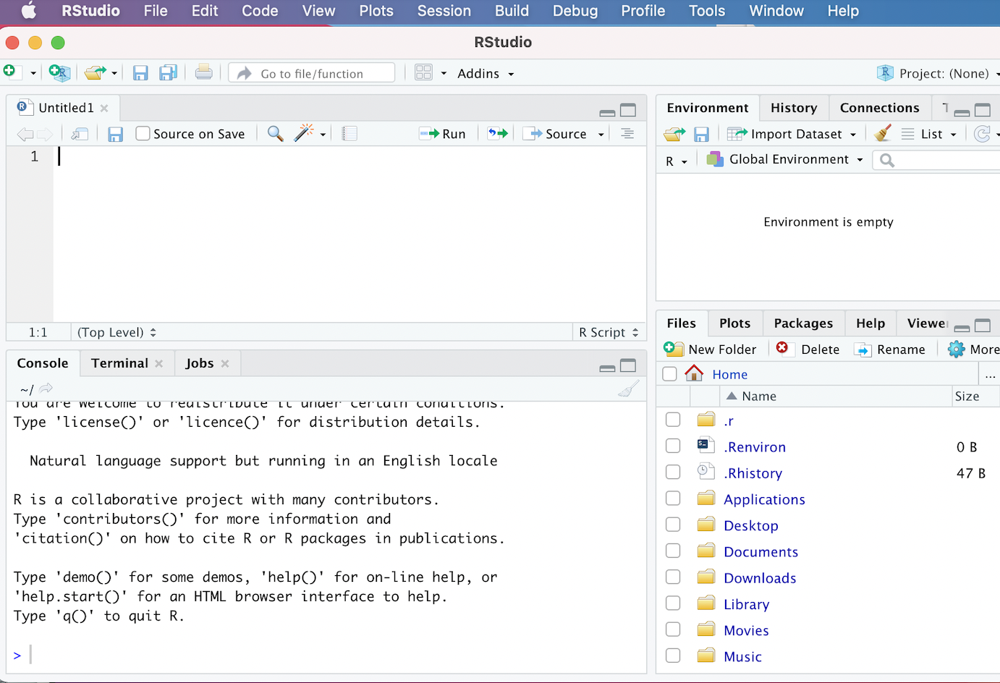

# Preliminaries and Set-Up

## Data 

The ICPSR data we will be mapping in this tutorial comes from a dataset archived on [openICPSR](https://www.openicpsr.org/openicpsr/). In particular, the dataset we will be working with is entitled "Governments' Responses to COVID-19", and was collected by Simon Porcher, a researcher at the University of Paris. The dataset's ICPSR landing page can be found [here](https://www.openicpsr.org/openicpsr/project/119061/version/V6/view), and the full citation information is below: 

Porcher, Simon. Governments’ Responses to COVID-19 (Response2covid19). Ann Arbor, MI: Inter-university Consortium for Political and Social Research [distributor], 2020-11-08. [https://doi.org/10.3886/E119061V6](https://doi.org/10.3886/E119061V6). 

This panel dataset provides information on public health and economic interventions initiated by national governments in response to the Covid-19 Pandemic. It provides data in monthly intervals from January 2020 to October 2020 for most of the world's sovereign countries. One of the variables in the dataset is an index (computed based on other variables in the dataset), that reflects the extent of government economic interventions to provide their populations with material support during this period of the pandemic. The tutorial will explore how to display country-level variation, with respect to this index on the scope of government economic responses to Covid-19, on a world choropleth map. For more information on this index and how it was constructed, please see the dataset's documentation. 

If you would like to follow along with the tutorial, please download the data that is provided at the dataset's ICPSR landing page (linked above) to your computer, and save it in a new directory that is specifically dedicated to the tutorial. 

## R and R Studio Installation

If you haven't already, please go ahead and install R and R Studio. R and R Studio must be installed separately; you should install R first, and then R Studio. R is the bare-bones computing environment, while R Studio is a visually appealing and user-friendly interface that allows users to interact with this environment in an intuitive way. Once you have both installed, you don't need to open up R and R Studio separately; you only need to interact with R Studio (which will run R in the background). 

The following subsections provide instructions on installing R and R Studio for the macOS and Windows operating systems. These instructions are taken from the "Setup" section of the Data Carpentry Course entitled [*R for Social Scientists*](https://datacarpentry.org/r-socialsci/setup.html). The Data Carpentry page also contains installation instructions for the Linux operating system; if you're a Linux user, please refer to that page for instructions. 

The Appendix to Garret Grolemund's book *Hands on Programming with R* provides an excellent overview of the R and R Studio installation process; you can access it [here](https://rstudio-education.github.io/hopr/). 

### Windows Installation Instructions

+ Download R from the [CRAN website](https://cran.r-project.org/bin/windows/base/)
+ Run the ```.exe``` file that was just downloaded.
+ Go to the [R Studio download page](https://www.rstudio.com/products/rstudio/download/#download) and under *Installers* select the "Windows" option.
+ Double click the file to install R Studio
+ Open R Studio to make sure it works. 

### macOS Installation Instructions

+ Download R from the [CRAN website](https://cran.r-project.org/bin/macosx/)
+ Select the ```.pkg``` file for the latest R version.
+ Double click on the downloaded file to install R.
+ It is also a good idea to install [XQuartz](https://www.xquartz.org/), which some packages require.
+ Go to the [R Studio download page](https://www.rstudio.com/products/rstudio/download/#download), and under *Installers* select the "macOS" option.
+ Double click the file to install R Studio
+ Open R Studio to make sure it works. 

## The R Studio Interface 

Now that we've installed and opened up R Studio, let's familiarize ourselves with the R Studio interface. When we open up R Studio, we'll see a window open that looks something like this:

```{r, echo=FALSE, results='asis', out.width='100%', fig.cap='The R Studio Interface', fig.alt='Screenshot of R Studio opened up on desktop with clean interface displayed'}

```

If your interface doesn't look exactly like this, it shouldn't be a problem; we would expect to see minor cosmetic differences in the appearance of the interface across operating systems and computers (based on how they're configured). However, you should see four distinct windows within the larger R Studio interface:

- The **top-left** window is known as the *Source*. 
  - The *Source* window is where we can write our R scripts (including the code associated with this tutorial), and execute those scripts. We can also type in R code into the "Console" window (bottom-left window), but it is preferable to write our code in a script within the source window. That's because scripts can be saved (while code written into the console cannot); writing scripts therefore allows us to keep track of what we're doing, and facilitates the reproducibility of our work. Note that in some cases, we may not see a *Source* window when we first open R Studio. In that case, to start a new script, simply click the ```File``` button on the R Studio menu bar, scroll down to ```New File``` button, and then select ```R Script``` from the menu bar that opens up.
  - It's also worth noting that the outputs of certain functions will appear in the *Source* window. In the context of our tutorial, when we want to view our datasets, we will use the ```View()``` function, which will display the relevant data within a new tab in the *Source* window. 
- The **top-right** window is the *Environment/History* pane of the R Studio interface. 
  - The "Environment" tab of this window provides information on the datasets we've loaded into R Studio, as well as objects we have defined (we'll talk about objects more later in the tutorial). 
  -The "History" tab of the window provides a record of the R commands we've run in a given session. 
- The **bottom-right** window is the *Files/Plots/Packages/Help/Viewer* window. 
  - The "Files" tab displays our computer's directories and file structures and allows us to navigate through them without having to leave the R environment. 
  - The "Plots" tab is the tab where we can view any visualizations (including maps) that we create. Within the "Plots" tab, make note of the "Zoom" button, which we can use to enlarge the display of our maps and visualizations if they're too compressed in the "Plots" window. Also, note the "Export" button within the "Plots" tab (next to the "Zoom" button); we can use this button to export the displayed map to a .png or .jpeg file that can be used outside of R Studio (we can also export our visualizations programmatically; we'll cover how to do so later in the tutorial).
  - The "Packages" tab provides information on which packages have been installed, as well as which packages are currently loaded (more on packages in Section 3.4)
  - The "Help" tab displays documentation for R packages and functions. If we want to know more about how a package or function work, we can simply type a "?" followed by the package or function's name (no space between the question mark and the name) and relevant information will be displayed within the "Help" tab. 
  - The "Viewer" tab displays HTML output. If we write code that generates an HTML file, we can view it within the "Viewer" tab.
- The **bottom-left** window is the *Console/Terminal/Jobs* window. 
  - The "Console" tab is where we can see our code execute when we run our scripts, as well as certain outputs produced by those scripts. In addition, if there are any error or warning messages, they will be printed to the "Console" tab. We can also type code directly into the console, but as we noted earlier, it is better practice to write our code in a script and then run it from there. 
  - The "Terminal", "R Markdown" and "Jobs" tabs  are not relevant for the tutorial. 

## Install Packages 

R is an open-source programming language for statistical computing that allows users to carry out a wide range of data analysis and visualization tasks (among other things). One of the big advantages of using R is that it has a very large user community among social scientists and statisticians, who frequently publish R packages. One might think of packages as workbooks of sorts, which contain a well-integrated set of R functions, scripts, data, and documentation; these "workbooks" are designed to facilitate certain tasks or implement given procedures. These packages are then shared with the broader community, and at this point, anyone who needs to accomplish the tasks to which the package addresses itself can use the package in the context of their own projects. The ability to use published packages considerably simplifies the work of applied social scientists using R; it means that they rarely have to write code entirely from scratch, and can build on the code that others have published in the form of packages. This allows applied researchers to focus on substantive problems, without having to get too bogged down in complicated programming tasks. 

In the context of this tutorial, generating maps of ICPSR data in R would be relatively complex if we had to write all our code from scratch. However, because we are able to make use of mapping and visualization packages written by other researchers, the task is considerably simpler, and will not require any complicated programming. 

In this tutorial, we will use a few packages to accomplish our goal of mapping tabular ICPSR data. They are:

+ *tmap*: The *tmap* package will allow us to create and customize a publishable map. 
+ *sf*: The *sf* package allows us to work with spatially explicit data within R.
+ *rnaturalearth*, *rnaturalearthdata*, *rgeos*: In order to visualize our data on a world map, we need a spatial dataset of the world's country boundaries. One way to get such a dataset is to download it from a public repository, and then load it into R Studio. However, these packages allow us to load a spatial dataset of world boundaries into R Studio without having to actually download anything, which effectively saves us a few steps in the workflow. 
+ *readxl*: The *readxl* package (part of a broader suite of data science packages known as the "tidyverse") will allow us to load the tabular ICPSR dataset, which is provided as an Excel file on the ICPSR landing page, into R Studio. 
+ *dplyr*: The *dplyr* package (also a part of the tidyverse) will allow us to efficiently transform the structure of the initial ICPSR dataset into a more tractable form that is conducive to mapping. 

To install a package in R, we can use the ```install.packages``` function. A function is essentially a programming construct that takes a specified input, runs this input (called an "argument") through a set of procedures, and returns an output. In the code block below, the name of the package we want to install (here, "tmap") is enclosed within quotation marks and placed within parentheses after printing ```install.packages``` Running the code below will effectively download the *tmap* package to our computer:

```{r, eval=FALSE}
# Installs "tmap" package
install.packages("tmap")
```

To run this code in your own R session:

* First, copy the code from the codeblock above (you can copy the code to your clipboard by hovering over the top-right of the code-block and clicking the "copy" icon; you can also highlight the code and copy from the ```Edit``` menu of your browser). 
* Then, start a new R script within R Studio; if you want to keep a future record of your work, you may want to save this script to your computer (perhaps in the same folder to which you downloaded the tutorial data). We can save our scripts via the R Studio "File" menu.
* Paste the code into the script, highlight it, and click the "Run" button that is just above the *Source* window.
* Alternatively, instead of copying/pasting, you can manually type in the code from the codeblock into your script (manually typing in the code is slower, but often a better way to learn than copy/pasting). 
* After you've run the code, watch the code execute in the console, and look for a message confirming that the package has been successfully installed. 

Below, we can see how that line of code should look in your script, and how to run it:

```{r, echo=FALSE, results='asis', out.width='100%', fig.cap='Installing tmap in R Script', fig.alt='Screenshot of R Studio interface; new script is open, with code to install tmap package highlighted; red box is drawn around the Run button that allows one to run code from the R Studio scripting window'}

```

Please note that you can follow along with the tutorial on your own computers by transferring all of the subsequent codeblocks into your script in just this way. Run each codeblock in your R Studio environment as you go, and you should be able to replicate the entire tutorial on your computer. 

Note that the codeblocks in the tutorial usually have a comment, prefaced by a hash ("#"). When writing code in R (or any other command-line interface) it is good practice to preface one's code with brief comments that describe what a block of code is doing. Writing these comments can allow someone else (or your future self) to read and quickly understand the code more easily than otherwise might be the case. The hash before the comment effectively tells R that the subsequent text is a comment, and should be ignored when running a script If one does not preface the comment with a hash, R wouldn't know to ignore the comment, and would throw an error message.

Now, let's install the other packages we mentioned above, using the same function: 

```{r, eval=FALSE}
# Installs remainder of necessary packages to complete exercise
install.packages("sf")
install.packages("rnaturalearth")
install.packages("rnaturalearthdata")
install.packages("rgeos")
install.packages("readxl")
install.packages("dplyr")
```

All of the packages we need are now installed!

## Load Libraries 

However, while our packages are installed, they are not yet ready to use. Before we can use our packages, we must load them into our environment. We can think of the process of loading installed packages into a current R environment as analogous to opening up an application on your phone or computer after it has been installed (even after an application has been installed, you can't use it until you open it!). To load (i.e. "open") an R package, we pass the name of the package we want to load as an argument to the ```library``` function. For example, if we want to load the "tmap" package into the current environment, we can type:

```{r, results=FALSE, message=FALSE}
# Loads "tmap" package
library(tmap)
```

At this point, the full suite of the *tmap* package's functionality is available for us to use. 

Now, let's go ahead and load the remainder of the packages that we'll need:

```{r, results=FALSE, message=FALSE}
# Loads remainder of packages
library(sf)
library(rnaturalearth)
library(rnaturalearthdata)
library(rgeos)
library(readxl)
library(dplyr)
```

At this point, the packages are loaded and ready to go! One important thing to note regarding the installation and loading of packages is that we only have to install packages once; after a package is installed, there is no need to subsequently reinstall it. However, we must load the packages we need (using the ```library``` function) every time we open a new R session. In other words, if we were to close R Studio at this point and open it up later, we would **not** need to install these packages again (3.4), but **would** need to load the packages again (3.5). 

## Set Working Directory 

Before we can bring our data into R Studio and begin the tutorial, we have to specify that data's location on our computer. This step is known as setting one's working directory. Before setting the working directory, make sure that you've downloaded the ICPSR dataset, and have placed it in a directory (i.e. folder) on your computer that is specifically dedicated to this tutorial. 

If you're unfamiliar with the concept of file paths, the easiest way to set your working directory is through the R Studio menu. To do so, follow these steps: 

+ First, Click on the "Session" menu on the R Studio menu bar at the top of your screen, and then scroll down to the "Set Working Directory" button in the menu that opens up. 
+ When you hover over the "Set Working Directory" button, a subsidiary menu that contains a button that says "Choose Directory" will open; click this "Choose Directory" button. 
+ In the dialog box that opens up, navigate to the directory that contains the ICPSR data, select it, and click "Open". At this point, your working directory should be set!

The graphic below demonstrates the process of setting one's working directory through R Studio's menus: 

```{r, echo=FALSE, results='asis', out.width='100%', fig.cap='Setting Working Directory Via Menus', fig.alt='Screenshot of R Studio window open, with the Session menu selected and red boxes drawn around the Set Working Directory and Choose Directory buttons within the Session menu'    }
knitr::include_graphics('images/setting_wd_revised.png')
```

**Alternatively**, if you are familiar with the concept of file paths, and know the file path to the folder containing the downloaded ICPSR dataset, you can set the working directly using the ```setwd()``` function, where the argument to the function is the relevant file path enclosed in quotation marks. For example:

```{r}
# Sets working directory 
setwd("/Users/adityaranganath/Documents/git_repositories/icpsr_mapping_manual/tutorial_data")
```

Note that you won't want to copy and paste the above codeblock, since your file path will be different; be sure to replace the file path above with your own. 


