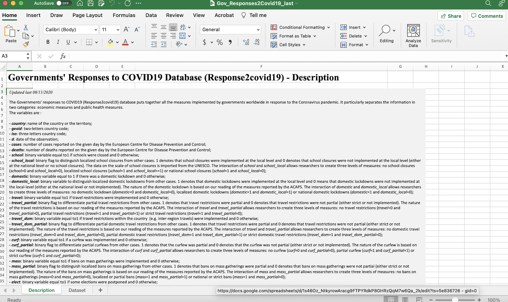
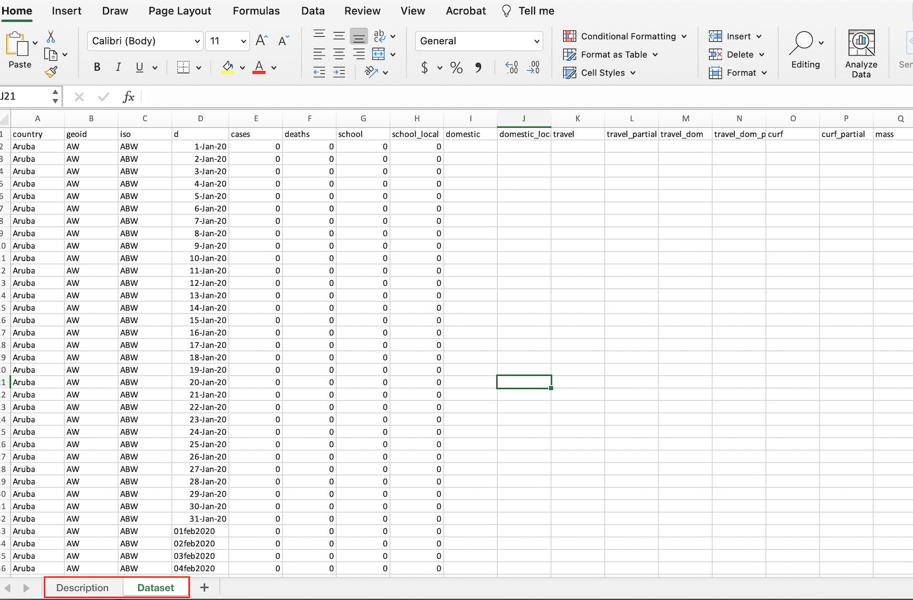
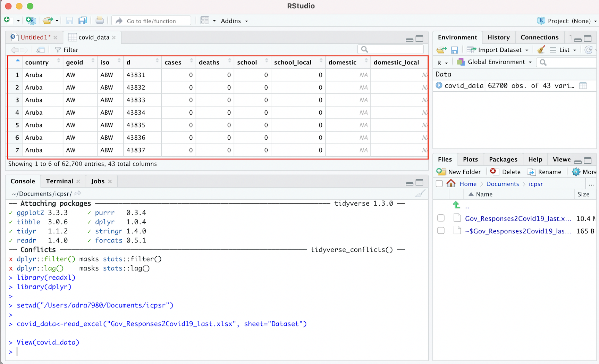
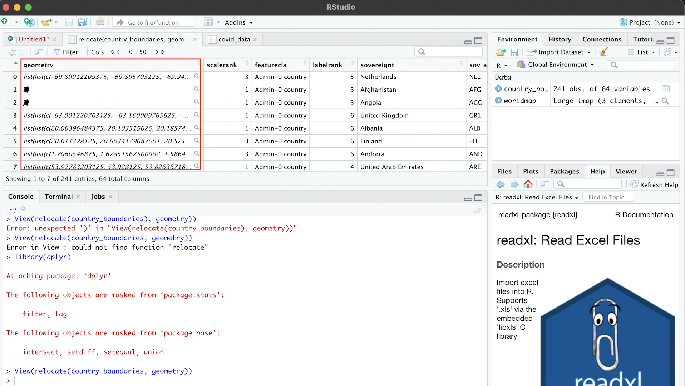
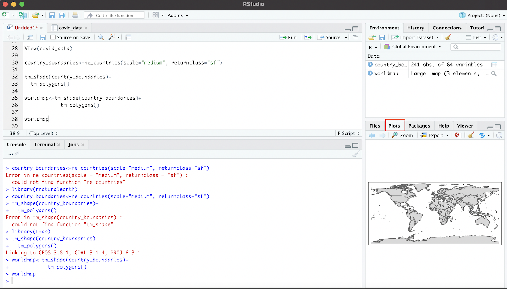
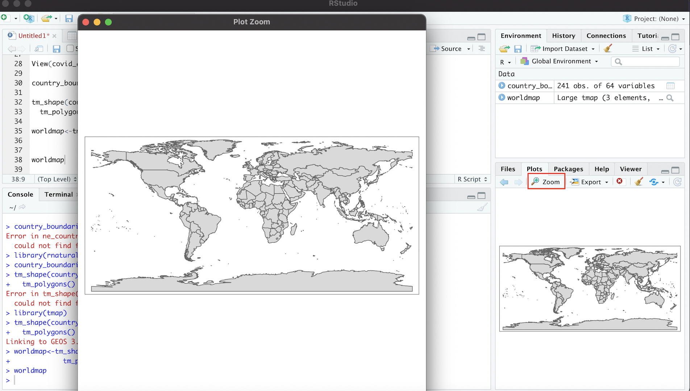
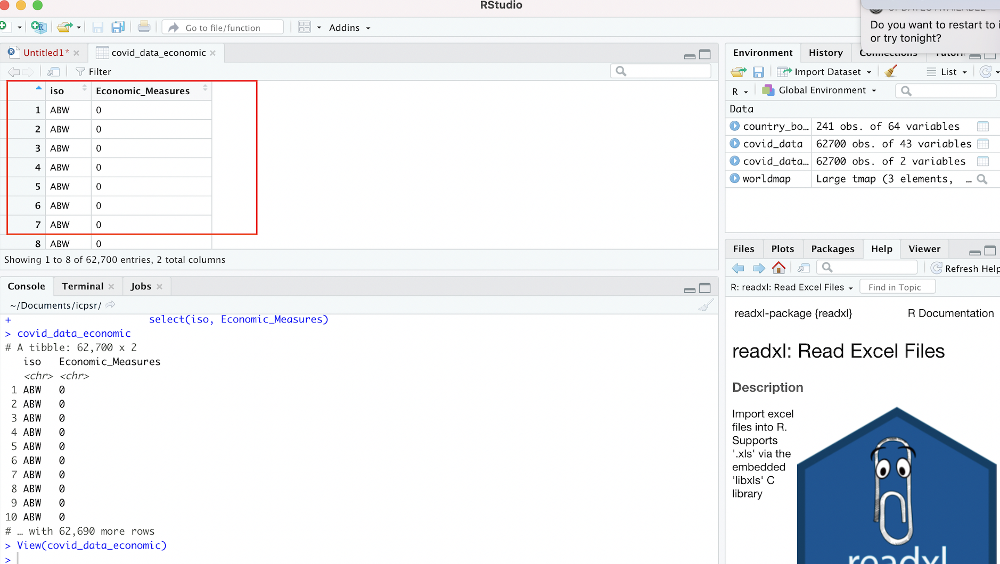
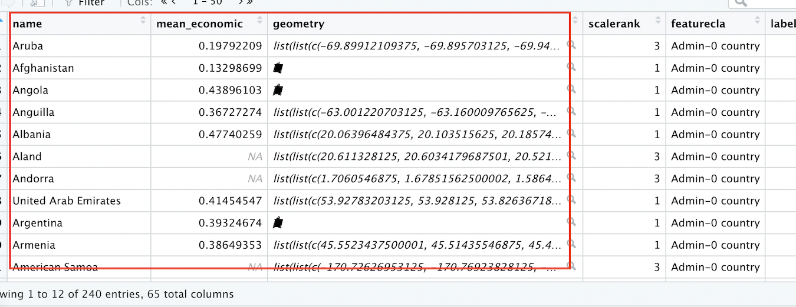

# Tutorial

```{r, include=FALSE}
library(tmap)
library(sf)
library(rnaturalearth)
library(rnaturalearthdata)
library(rgeos)
library(tidyverse)
library(readxl)
library(dplyr)
```

## Load and View Data 

Now that we've taken care of those preliminary steps, let's bring in the tutorial data into our R environment so that we can begin working with it. There are two pieces of data we'll need to load:

* The ICPSR tabular dataset on government policy responses to Covid-19 (Section 4.1.1)
* A spatial dataset of world country boundaries; we will bring this dataset into R Studio via the ```ne_countries``` function of the "rnaturalearth" package (Section 4.1.2)

### ICPSR Covid-19 Tabular Data

When importing tabular data that you have saved on our computer into R Studio, it's important to first understand some of the details of the data we're trying to import. The first thing to note is the type of file we're working with, which is indicated by the file extension; here, we can note that the ICPSR data is a .xlsx file, which means that it's an Excel file (but note that .xlsx files can also be opened in spreadsheet software programs other than Excel). That means we'll have to import it into R Studio using a function designed specifically to handle Excel files. To that end, we'll use the ```read_excel``` function from the *readxl* package. Recall that if you want to learn more about a function or a package, simply type a question mark followed by the package or function name in the console, and relevant information will appear in the "Help" tab of the "Files/Plots/Packages/Help/Viewer" window on the bottom right of our R Studio interface. For example, if we wanted to learn more about the ```read_excel```function, we would type ```?read_excel``` into the console. 

Before using the ```read_excel``` function to bring in the , it could be helpful to open up the data outside the R environment to see whether the dataset has any features that we have to account for when loading it into our R environment. When we first open the spreadsheet, it will look something like this:

```{r, echo=FALSE, results='asis', out.width='100%', fig.cap='ICPSR Dataset in Spreadsheet: Description Tab'}

```

Note that when we open the spreadsheet, we land on its first tab (or "sheet"), which is titled "Description". This part of the spreadsheet effectively functions as a data codebook, which we can look through to understand the dataset's various variables and and assess how they were measured. To open up the actual dataset, we can toggle to the "Dataset" tab by pressing the corresponding button on the bottom-left of the spreadsheet (highlighted in red below): 

```{r, echo=FALSE, results='asis', out.width='100%', fig.cap='ICPSR Dataset in Spreadsheet: Dataset Tab'}

```

The fact that the ICPSR dataset has two sheets within it is important; it means that when we load it into R, we'll have to explicitly specify the sheet (i.e. the "Dataset" sheet) we want to import. 

Now, let's go ahead and load the "Dataset" sheet of the ICPSR data file. Type the following code into your script, and run it:

```{r, echo=-1}
setwd("/Users/adityaranganath/Documents/git_repositories/icpsr_mapping_manual/tutorial_data")
# Imports "Dataset" sheet from ICPSR Excel file into R Studio, and assigns the dataset to an object called "covid_data"
covid_data<-read_excel("Gov_Responses2Covid19_last.xlsx", sheet="Dataset")
```

Let's unpack that code. As we noted above, ```read_excel``` is the function used to bring in Excel spreadsheet data into R. The function has two arguments; the first ("Gov_Responses2Covid19_last.xlsx") is the name of the file we want to import, while the second (sheet="Dataset") specifies that we specifically want to import the the "Dataset" sheet from that Excel file. This code is then assigned, using ```<-``` (R's assignment operator) to a new object that we call ```covid_data```. This means that the output of the code on the right hand side of the assignment operator is now assigned to the ```covid_data``` object. Think of this object as a container of sorts, one which holds, or "contains", the output of the code to the right of the assignment operator. Object assignment isn't necessary; we could have brought the data into R Studio by simply typing the code to the right of the assignment operator. However, assigning the dataset to an object allows for the more flexible and intuitive handling of data, so it is a common practice. 

Note that after typing the code from the previous codeblock into your R script and running it, you still won't actually see the dataset within the R environment. There are many ways to pull up and inspect the data; in this tutorial, we'll use the ```View``` function, which will bring up the data as a separate tab in the "Source" window. To display the contents of the ```covid_data``` object (in other words, the dataset we just imported), type and run the following code: 

```{r}
# Brings up dataset held in the "covid_data" object in R Studio's data viewer
View(covid_data)
```

Within your R Studio environment, the result of running ```View(covid_data)``` will look something like this (dataset outlined in red):

```{r, echo=FALSE, results='asis', out.width='100%', fig.cap='Viewing ICPSR Dataset in R Environment'}

```

You can scroll up/down and across the dataset within the data viewer. 

### Country Boundaries Spatial Data

Now that we have our tabular data on government responses to Covid-19 loaded into R Studio, let's bring spatial data on world country borders into memory. Eventually, we'll represent the Covid-19 data on a map by joining it to the spatial data on country boundaries that we will now bring in.

When working with spatial data in R, you will sometimes want to import data that you collected on your own, or data that you downloaded. There are several functions in the ```sf``` package that will allow you to easily import your external spatial data in R; if you need to do this, you should consult the package's documentation.

In our case, we won't have to download and import the spatial data we need into R Studio, since there are R packages that already contain this spatial data. In particular, we'll use the ```ne_countries``` function of the *rnaturalearth* package to bring the country border dataset into our R environment. Note the two arguments we pass into the ```ne_countries``` function: the "scale" argument specifies that we want to use a medium scale when rendering the map (the other options are 'small' and 'large'), while the "returnclass" argument specifies that we want the spatial dataset in 'sf' format, which is a spatial data format that works well with the *tmap* mapping package we'll use later. As in the previous section, we'll assign the dataset to an object so that we can easily work with it later; we'll call this object "country_boundaries":

```{r}
# Brings spatial dataset of country boundaries into R environment using the rnaturalearth package
country_boundaries<-ne_countries(scale="medium", returnclass="sf")
```

Now that we have this spatial dataset in memory and assigned to an object, let's step back and clarify what exactly a spatial dataset is. In some respects, a spatial dataset is like a typical tabular dataset. To see this, let's pass the "country_boundaries" object through the ```View()``` function to open up the dataset:

```{r}
View(country_boundaries)
```

By scrolling across the dataset, you'll notice that each row corresponds to a country, and that there are many columns that correspond to various country-level attributes. The key column, however, which makes this a spatial dataset (as opposed to merely a tabular one), is the information contained in a column called "geometry". This column contains geographic coordinate information that essentially defines a polygon for each country in the dataset. The "geometry" column is likely one of the last columns in the dataset, so you may have to scroll a bit to find it. Alternatively, we can use the ```relocate``` function in the *dplyr* package to make the "geometry" column the first column in the dataset within "country_boundaries", and then view this reordered dataset using the ```View``` function. The first argument passed to the ```relocate``` function ("country_boundaries") indicates the object that contains the relevant dataset, and the second argument ("geometry) indicates the name of the column we want to move to the front of the dataset. 

```{r}
View(relocate(country_boundaries, geometry))
```

After typing in that code and running it in your script, the window with the reordered dataset should appear in your source window; note the "geometry" tab:

```{r, echo=FALSE, results='asis', out.width='100%', fig.cap='Geometry Column Contains Spatial Information'}

```

We can use the information in the "geometry" tab to draw georeferenced polygons for each row in the spatial dataset, which will yield a world map! To translate the information in the geometry tab into a cartographic representation, we'll use a package called *tmap*. To bring up the features of the dataset, we have to first tell *tmap* what dataset contains the information we want to map; we do this by first passing the name of the object that contains the relevant dataset (here, "country_boundaries") to the ```tm_shape``` function, and then specifying that our features (i.e. country borders) are represented as polygons through the ```tm_polygons``` function. The ```tm_polygons``` function does not require any arguments. In the *tmap* package, we can connect functions together through a plus sign (+). When we type in and run the following code, the result is a map that is rendered based on the information in the "geometry" column:

```{r, fig.asp=0.5}
# maps geographic features (i.e. countries) of spatial dateset
tm_shape(country_boundaries)+
  tm_polygons()
```

We can assign this map to an object, just as we assigned the ICPSR tabular dataset to an object. Let's call this object "worldmap."

```{r}
# assigns map of geographic features to a new object called "worldmap" 
worldmap<-tm_shape(country_boundaries)+
            tm_polygons()
```

Having assigned the map to the "worldmap" object, we can bring up the map whenever we want by simply calling "worldmap" object: t:

```{r, fig.asp=0.5}
# calls "worldmap" object to display country-level map generated from the "country_boundaries" spatial dataset 
worldmap
```

Within the R Studio interface, we can see the above map within the bottom-right window after selecting the "Plots" tab:

```{r, echo=FALSE, results='asis', out.width='100%', fig.cap='World Map in "Plots" Tab (Rendered from Spatial Dataset'}

```

We can enlarge the map in this window by clicking the "Zoom" link; this will produce an enlarged version of the map in a separate window:

```{r, echo=FALSE, results='asis', out.width='100%', fig.cap='Enlarging Map with "Zoom" Button'}

```

## Edit Spatial Data

We can edit spatial datasets in R Studio with relative ease, using commonly used R packages. Let's say, for example, that we don't want Antarctica to appear on our map (since Antarctica typically does not appear on political maps of the world). 

To delete Antarctica from the map, we first need to delete the row that corresponds to Antarctica from the spatial dataset contained in the "country_boundaries" object. We can do so with the following code:

```{r}
# Deletes Antarctica from spatial dataset in "country_boundaries" object
country_boundaries<-country_boundaries %>% filter(iso_a3 !="ATA")
```

We can translate this code into ordinary language as follows: "Take the existing country boundaries dataset (```country_boundaries``` to the left of the ```%>%``` and after the assignment operator) and then (``` %>% ```, a symbol called a pipe, which is used to chain together code) select only the countries that are not Antarctica (```filter(iso_a3 !="ATA"```). Take this new dataset, which doesn't include Antarctica, and assign it back to the existing 'country_boundaries' object (```country_boundaries<-```), which effectively replaces the previous spatial dataset in the country_boundaries object (which did include Antarctica)." 

Two things may require additional elaboration:

* First is the pipe, the symbol that looks like this: %>%. The pipe operator essentially takes the output of the code on its left, and then use that output as an input to the code on its right. Here, the pipe is taking the output of the Here, the pipe is taking the output of the "country_dataset" object (i.e. the existing spatial dataset) on its left, and then using that output as an input to the ```filter``` function on its right. In other words, the pipe operator links the code on its two sides, and indicates that the object being passed through the ```filter``` function is the "country_boundaries" object. 
* The ```filter``` function  is a function from the *dplyr* package that allows one to select rows from a dataset by specified criteria. In our case, we want to select all rows from the dataset that are not Antarctica. The argument to the ```filter``` function, ```iso_a3 !="ATA"```, is essentially saying "return any records where the iso_a3 variable in the attribute table (the 3-digit ISO country code) is NOT equal to "ATA" (Antarctica's code). Note that ```!=``` is R syntax for "not equal to".^[If we were to instead type ```filter(iso_a3=="ATA)```, the function would *only* select the Antarctica row from the dataset and discard everything else.]

Now, let's see this change reflected in the corresponding map. To do so, we must update the "worldmap" object by rerunning the object assignment. The worldmap object we defined above will not automatically reflect the edits we just made to the "country_boundaries" dataset; we need to run the code again with the edited version of the dataset "country_boundaries" object passed through the ```tm_shape``` function:

```{r}
worldmap<-tm_shape(country_boundaries)+
            tm_polygons()
```

Now, let's view our updated map:

```{r, fig.asp=0.5}
worldmap
```

As desired, Antarctica has been deleted from the spatial dataset, and therefore no longer appears on the corresponding map. 

## Process ICPSR Tabular Data for Mapping

In order to represent the ICPSR data on governments' economic responses to Covid-19 on a map, we must join the ICPSR dataset (contained in the "covid_data" object) to the spatial dataset (contained in the "country_boundaries" object); at that point, we'll have a new, integrated dataset that will include the country-level Covid-19 data of interest in a spatial dataset. We can then display that Covid-19 information on a map by using the ```tmap``` package. 
Before we can take those steps, however, we need to process the ICPSR tabular data with a view towards facilitating the joining and mapping process.

### Select Variables

When working with data in R, it is often useful to get a quick sense of a given dataset's dimensions, which we can do using the ```dim``` function. Below, we pass the "covid_data" object through the ```dim``` function:

```{r}
dim(covid_data)
```

The output indicates that there are 62700 rows in the dataset, and 43 columns. This suggests that there are quite a few variables in the dataset. Given that we're only interested in mapping (for now) the variable that represents an aggregate index (computed from other variables in the dataset) of the generosity of governments' economic support measures in response to the pandemic, we'll go ahead and delete superfluous columns so as to keep the size of the final (joined) dataset tractable. The name of the variable we'd like to map, and therefore keep, is "Economic_Measure" (see the dataset's documentation for more details). In addition to keeping this variable, we also need to keep a column titled "iso", which is the 3-digit ISO country code; this ISO code also exists in the spatial dataset to which we want to join the "Economic_Measure" variable, and so we will use these ISO codes as the joining variable. 

Let's create a new object, which we'll call "covid_data_economic", to contain this smaller dataset comprised of the ISO code and the economic interventions index we're interested in mapping:

```{r}
covid_data_economic<-covid_data %>% 
                      select(iso, Economic_Measures) 
```

The above code can be translated as follows: "Start with the dataset in the 'covid_data' object ('covid_data'), and then keep the 'iso' and 'Economic_Measures' columns but discard everything else ('select(iso, Economic_Measures)). Assign this new 2-column dataset to a new object called 'covid_data_economic' ('covid_data_economic<-')." We can take a look at this smaller dataset extracted from the original dataset by passing the "covid_data_economic" object as an argument to the now-familiar ```View``` function:

```{r}
View(covid_data_economic)
```

Within the "Source" window, a new tab that contains the smaller 2-column dataset that is within the "covid_data_economic" object will appear:


```{r, echo=FALSE, results='asis', out.width='100%', fig.cap='New Dataset Based on Selection from Original Dataset'}

```

Note that the original Covid-19 policy responses dataset, stored in the "covid_data" object, is unaffected by our creation of a new dataset based on the selection of these two variables. You can confirm that this original data is still stored in the "covid_data" object by opening it up:

```{r}
View(covid_data)
```

We can go back to this initial dataset (in the "covid_data" object) anytime we might need, but for now we'll set it aside and start working with our newly created dataset in the "covid_data_economic" object. 

### Change class of "Economic_Measures" Index

Recall that the data we want to map is contained within the "Economic_Measures" field of the dataset in the newly created "covid_data_economic" dataset. R has six fundamental "types" of data: character, numeric, integer, logical, and complex. The code below extracts the "Econmic_Measures" column from the dataset (placing a dollar sign in between the name of an object containing a dataset, and a column containing that dataset, as in ```covid_data_economic$Economic_Measures``` is a way of isolating and extracting a column from a larger dataset), and then passes it through the ```class``` function to identify the class of the "Economic_Measures" field. 

```{r}
# Find the class of the "Economic_Measures" field
class(covid_data_economic$Economic_Measures)
```

We can see from the above output that the class of the "Economic_Measures" variable is "character", which implies that although the information in the "Economic_Measures" variable looks like it is numeric, R is not actually reading that data as numbers. So, we have to change the way that data is encoded, and ensure that it will be interpreted numerically; the failure to do this will prevent us from making numerical calculations using this data, as well as from mapping it using *tmap*. We can essentially recode the information in the "Economic_Measures" variable as "numeric" using the following code: 

```{r}
# Changes class of "Economic_Measures" field from character to numeric
covid_data_economic$Economic_Measures<-as.numeric(covid_data_economic$Economic_Measures)
```

In the code above, the code to the right of the assignment operator extracts  the "Economic_Measures" column from the the "covid_data_economic" dataset, and then changes its class to numeric using the ```as.numeric``` function. The assignment operator then assigns this numeric version of the "Economic_Measures" field back into the original dataset contained in the "covid_data_economic" object (the one with the character field); in performing this assignment, the "character" version of the "Economic_Measures" field is replaced with the "numeric" version. At this point, the "Economic_Measures" column in our dataset within the "covid_data_economic" object is numeric; we can confirm this by passing the column through the class function once again:

```{r}
# Find the class of the updated "Economic_Measures" field
class(covid_data_economic$Economic_Measures)
```

### Compute average of "Economic_Measures" index

As we mentioned earlier, the ICPSR dataset on government policies with respect to Covid-19 is a time-series dataset, containing monthly observations over the course of about a year during the pandemic (January 2020 to October 2020). This means that we have to make some choices about how to represent the "Economic_Measures" index on a map. For example, do we want to pick one of the months to map? Do we want to map the change across two different months? Do we want to map the average index value across all the months in the sample? 

There are of many possibilities, but let's choose to go ahead and map the average. That is, for each country, we'll average the value of the "Economic_Measures" index across all of the months in the dataset; the value that we'll eventually map will be this average value of the "Economic_Measures" index.

To that end, we need to take our current "covid_data_economic", which contains monthly observations for each country, and transform it into a new dataset that contains the monthly average of the "Economic_Measures" index for each country. 

The code below carries out this transformation of the data: 

```{r, message=FALSE}
# Calculate Country-Level Averages for "Economic_Measures" Index, and then assign this new dataset of country-level averages to a new object called "covid_data_economic_avg". 
covid_data_economic_avg<-covid_data_economic %>% group_by(iso) %>% 
                                                summarize(mean_economic=mean(Economic_Measures, na.rm=FALSE))
```

Let's unpack this code, starting with the code that's to the right of the assignment operator. 

* We start by calling the "covid_data_economic" object, which establishes that this is essentially the "base" dataset we wish to modify. 
* Then (recall that the ``` %>% ``` is used to chain together code by taking the output on the left and passing it as input into the code to its right), we call the ```group_by``` function, and pass "iso" as an argument to this function; this stipulates that all observations with the same ISO code are to be considered a group, and that any subsequent calculations will therefore be performed at the country level. This step ensures that when we calculate the mean of the "Economic_Measures" variable, the function will return the mean value of this index for each individual country, rather than the mean value for the dataset as a whole. 
* After setting the grouping variable and using another pipe (``` %>% ```) to establish that we are passing the newly grouped dataset as an input into the subsequent code, we call the ```summarize``` function. This function creates a new dataset based on the calculation of summary statistics for an existing dataset. By calling ```summarize```, we are specifying that we want to create a new dataset to hold the information on country-level averages for the "Economic_Measures" data.
* Within the ```summarize``` function, we first need to create a name for the column that will contain the country-level averages for the "Economic_Measures" index. We'll call this variable "mean_economic", which corresponds to the very first part of the code after the parentheses. We set this variable equal to an expression that passes the "Economic_Measures" variable through the ```mean``` function. In essence, this calculates the mean of the "Economic_Measures" variable for each country (it calculates the country-level mean because we specified the grouping function, ```group_by(iso)```, in the previous line of code), and creates a column in the newly created dataset named "mean_economic" to store this information. The code that reads ```na.rm=FALSE``` simply specifies that missing data should be ignored in the calculation of the mean value of the "Economic_Measures" index. 
* Finally, the this new dataset, consisting of two columns (one column containing ISO codes, and the other, named "mean_economic" containing the corresponding country-level mean of the "Economic_Measures" variable) is assigned to a new object called "covid_data_economic_avg". 

We can translate the above code as follows: "Take the existing dataset within the 'covid_data_economic' object, and then group this dataset by the ISO country codes; then, generate a new dataset, containing one column with ISO country codes, and another column, named "mean_economic", that contains information on the country-level mean of the 'Economic_Measures' index. Finally, assign this new dataset to an object called 'covid_data_economic_avg'"

To inspect this new dataset within the Source window, simply pass the object through the ```View``` function. 

```{r}
View(covid_data_economic_avg)
```

We should see something that looks like this: 


```{r, echo=FALSE, results='asis', out.width='100%', fig.cap='Dataset of Country-Level Averages for "Economic_Measures" Index'}
knitr::include_graphics('images/mean_economic.png')
```

### Calculate Summary Statistics

Now that we have a dataset containing the country-level average of the "Economic_Measures" index (which is the data we'd like to map), it can be useful to get a sense of how the data is distributed. We can easily do this by using the ```summary``` function, which returns a table of summary statistics for a specified variable. The following code produces summary statistics for the "mean_economic" variable within the dataset that is contained in the "covid_data_economic_average" dataset (which is written as ```covid_data_economic$mean_economic```):

```{r}
summary(covid_data_economic_avg$mean_economic)
```

## Join Datasets

We're almost ready to map our data. But before doing that, we will have to take our dataset of average "Economic_Measures" scores by country (contained in the "covid_data_economic_avg" object we just created), and then join this dataset to our previously discussed spatial dataset of country boundaries (contained in the "country_boundaries" object). In other words, before mapping our variable of interest, we need to bring this variable into the dataset of country boundaries. 

The task of joining, or "merging" datasets is a very common procedure when working with social science data (or any data for that matter), since data is often held in many different locations; before being able to analyze it, one has to bring all of the relevant data into the same dataset. That is essentially what we're doing here.

How do we join different datasets together? Associating two datasets into one larger dataset that combines information from both requires the datasets to share a common field; this common field can be used to essentially “glue” the datasets together. The International Organization for Standardization provides 3-digit country codes for each of the world’s countries that can be used to uniquely identify countries when working with country-level data. Both our spatial dataset, and our table of the "Economic_Measures" index averages, contain a field with these standardized 3-digit ISO codes (this field is labelled “iso_a3” in the spatial dataset, and “iso” in the dataset containing the "Economic_Measures" average). We we will therefore use the 3-digit country code field to join the column containing the "Economic_Measures" average to the spatial dataset. 

The code below carries out this task:

```{r}
# Join dataset with country-level means for "Economic_Measures" index
# (in "covid_data_economic" object) to spatial dataset of world boundaries 
# (in "country_boundaries" object), based on common 3-Digit ISO Codes

worldmap_covid_data_economic<-full_join(country_boundaries, covid_data_economic_avg, by=c("iso_a3"="iso"))
```

* In the code above, we use the ```full_join``` function to connect our datasets together. A "full join" keeps all rows in both datasets, even if one dataset does not have certain rows (i.e. countries) that the other does not (and vice-versa). For more information on different join options, explore the documentation by inspecting the function's documentation (```?full_join```). 
* The first argument to the full_join function is "country_boundaries", which is of course the object containing our spatial dataset. 
* The second argument, "covid_data_economic_avg" is the tabular dataset containing information on country_level averages for the Covid economic intervention index (i.e. the data we ultimately want to map).^[It's worth noting that when we are joining a tabular dataset to a spatial dataset with a view towards visualizing the information within the tabular data on a map, the object containing the spatial dataset should be listed before the object containing the tabular dataset. If we reverse this order, we'll have to take some additional steps to get the joined dataset ready to map, and this is best avoided.] 
* The third argument specifies the join fields, i.e. the fields within the datasets that contain the common variable that can be used to correlate the records in the two different datasets and weld them together. In our case, the join variable is of course the 3-digit country ISO code. The argument that reads ```by=c("iso_a3"="iso")``` simply indicates that we want to join the datasets based on the set of country identifiers given by the 3-digit ISO codes; because the name of the column containing the 3-digit codes is different in the two datasets, the expression in the parentheses ```"iso_a3"="iso"``` simply indicates that the column named "iso_a3" (in the spatial dataset) and the column named (iso) in the tabular dataset are equivalent to each other, and are to be used as the join fields. If they didn't have different names--for example, if the ISO codes were in a column named "iso" in *both* datasets--we could simply have written ```by=iso``` to specify the join column.
* Finally, we take our newly created dataset, which adds the data we want to map into the spatial dataset, and assign it to a new object that we can call when building our map(s). We call this object "worldmap_covid_data_economic." 

We can translate the code in the previous code block as follows: "Join the dataset in the 'covid_data_economic_avg' object to the spatial dataset in the 'country_boundaries' obejct using columns in each of the two datasets containing information on countries' 3-Digit ISO codes as the join fields (the column with ISO information in the spatial dataset is named 'iso_a3' while the column with ISO information in the tabular dataset is 'iso'). Finally, assign the joined dataset that results to a new object called 'worldmap_covid_data_economic.'"  

Before proceeding, Let's take a quick look at our newly created joined dataset. To make it easy to inspect, we can move up the variables we're interested in (country name, the "mean_economic" variable, and the geometry information that makes the data spatial in nature) up to the front of the dataset:

```{r}
worldmap_covid_data_economic<-worldmap_covid_data_economic %>% relocate(name, mean_economic, geometry)
```

After moving these variables by using the ```relocate``` function with the relevant variables as arguments, pass the name of the object containing the joined data ("worldmap_covid_data_economic"), whose variables have now been relocated, through the familiar ```View``` function:

```{r}
View(worldmap_covid_data_economic)
```

The dataset that opens up in your Source window should look something like this:

```{r, echo=FALSE, results='asis', out.width='100%', fig.cap='Spatial Dataset With Covid-19 Economic Index Data'}

```

Note that we now have a spatial dataset of country boundaries (as indicated by the "name" and "geometry" fields), with the data we want to map (the mean, for each country, of the Covid-19 Economic intervention index during the period under consideration) now included in a field within the spatial dataset. 

## Make Maps

We're finally ready to represent the tabular data we started with on a map! To do so, we'll use the *tmap* package, which we already used above to view a rendered version of our spatial dataset. Now, we'll actually represent our data on the map features.  

### Make a Preliminary Map

As with anything else in R, we can assign maps created with the *tmap* package to objects, which makes it easy to subsquently work with them. We'll create an object called "covid_economic_map" to contain the map we will build using *tmap*. We can create a rough draft of a map and assign it to an object with two relatively simple lines of code:

```{r}
covid_economic_map<-tm_shape(worldmap_covid_data_economic)+
                      tm_polygons(col="mean_economic", n=8, style="jenks", palette="BuGn")
```

In the code above that is to the right of the assignment operator, we first use *tmap's* ```tm_shape``` function to specify the spatial dataset whose feature's we'd like to display. Within *tmap*, chaining together functions requires a ```+``` sign, so we add a ```+``` before moving to another function on the next line. This is the ```tm_polygons``` function, which we use because our spatial dataset of country boundaries represents those boundaries as polygons.
The ```tm_polygons``` function can take a variety of arguments that can help us to customize our map; we'll introduce a few more arguments below, but if you want to see the full range of possible arguments, be sure to check out the function's documentation (```?tm_polygons```). Now, tet's consider the arguments that are being passed through the ```tm_polygons``` function:

* ```col="mean_economic"``` specifies the name of the column in the spatial dataset (which has been specified with the ```tm_shape``` function) that contains the data we'd like to map. Recall from the previous section that the name of this column is "mean_economic." 
* ```n=8``` specifies that we want the data to be partitioned into 8 bins 
* ```style="jenks"``` indicates that we want to set break points in the data distribution using the Jenks Natural Breaks Classification; to see other options for partitioning your data, see the function's documentation. For more information on the Jenks Natural Breaks Classification, as well as other data partition algorithms, see [here](https://pro.arcgis.com/en/pro-app/2.7/help/mapping/layer-properties/data-classification-methods.htm). 
* ```palette="BuGn"``` specifies the color scheme we want to use to represent the data. Check out this extremely useful [guide](https://www.nceas.ucsb.edu/sites/default/files/2020-04/colorPaletteCheatsheet.pdf) on colors and palettes in R (including information on relevant color codes). "BuGn" refers to a blue-green color gradient, which is used to represent variation in the data that's being mapped. 

To see what the map looks like, simply call the object which contains it: 

```{r, fig.asp=0.5, message=FALSE, warning=FALSE}
covid_economic_map
```

As in Section 4.1.2 above, we can see the map in the "Plots" tab of the bottom-right window, and can open up a larger window by clicking the "Zoom" button right below the "Plots" tab.

Of course, the map we've just created needs a bit of work (most noticeably, the legend needs to be moved to a less distracting location), but after all of the previous work to set up our data, hopefully it feels exciting to finally see our tabular data transformed into a map!

Before we work on the legend, we can see how to change certain features of the map using arguments to the ```tm_polygons``` function that we've already discussed. For instance, let's say we want a Yellow to Red palette ("YlOrRd"; again, remember you can look up these codes at the color guide linked above), only five intervals for the data, and want the data to be partitioned across intervals equally (rather than by using the Jenks algorithm). Let's make a new map object to contain this map, called "covid_economic_map_alternative."

```{r}
covid_economic_map_alt<-tm_shape(worldmap_covid_data_economic)+
                      tm_polygons(col="mean_economic", n=5, style="equal", palette="YlOrRd")
```

Let's display the map in the "covid_economic_map_alt" object; notice the change in color, the fewer number of classes, and the equal intervals in the legend: 

```{r, fig.asp=0.5, message=FALSE, warning=FALSE}
covid_economic_map_alt
```

Note that we can easily remove the map frame if we'd prefer not to have that, with the "Frame" argument to the ```tm_layout``` function.

```{r, fig.asp=0.5, message=FALSE, warning=FALSE}
# Removes frame from "covid_economic_map_alt" map object
covid_economic_map_alt<-covid_economic_map_alt+
                          tm_layout(frame=FALSE)

# Views amended map object without frame:
covid_economic_map_alt
```


### Customize Legend

The biggest issue with the rough drafts of our map from the previous section is the position of the legend. Let's go back to the first map we made (in the "covid_economic_map" object), and simply switch its legend position, using an argument in the ```tm_legend``` function. We'll also remove the map frame. 

```{r, fig.asp=0.5, message=FALSE, warning=FALSE}
## Shift legend position
covid_economic_map<-tm_shape(worldmap_covid_data_economic)+
                      tm_polygons(col="mean_economic", n=8, style="jenks", palette="BuGn")+
                      tm_layout(frame=FALSE)+
                      tm_legend(position=c("left", "bottom"))
## View Map
covid_economic_map
```

Currently, our legend is discrete, but we may want to try using a continuous legend to better match the continuous nature of the index. We can do this by changing the "style" argument to the ```tm_polygons``` function. We'll 

```{r, fig.asp=0.5, message=FALSE, warning=FALSE}

## Changes "style" argument parameter to "cont" to make continuous legend
covid_economic_map<-tm_shape(worldmap_covid_data_economic)+
                      tm_polygons(col="mean_economic", style="cont", palette="BuGn")+
                      tm_layout(frame=FALSE)+
                      tm_legend(position=c("left", "bottom"))
## View Map
covid_economic_map
```

Let's explore some additional ways to customize our legend:

* Notice that the legend has a "Missing" category, to indicate countries for which we don't have data on the Covid-19 economic index. Instead of labelling it "Missing" we'll' label it as "No Data".
* Let's give the legend a title that describes the data: Mean of Covid Economic Intervention Index (1/1/2020 to 10/1/2020)".
* It's possible to experiment with different legend orientations. To see this, let's flip the legend's orientation, turning it into a horizontal rather than vertical bar.
* It's also possible to specify our own intervals for the legend; we'll set our legend breaks at 0, 0.25, 0.5, and 0.75.
* We'll customize the size of our legend, as well as the legend's text. 
* We'll alter the location of our legend. 

The following code incorporates these changes into the previous map:

```{r, fig.asp=0.5, message=FALSE, warning=FALSE}
covid_economic_map<- tm_shape(worldmap_covid_data_economic)+
                      tm_polygons(col="mean_economic", 
                                  style="cont", 
                                  palette="BuGn", 
                                  textNA="No Data", 
                                  title="Mean of Covid\nEconomic\nIntervention Index\n(1/1/2020 to\n 10/1/2020)", 
                                  legend.is.portrait=FALSE,
                                  breaks=c(0,0.25,0.5, 0.75))+
                      tm_layout(legend.title.size=0.7, 
                                legend.title.fontface=2,
                                legend.position = c(0, 0), 
                                frame=FALSE, 
                                legend.text.size = 0.5,
                                legend.width = 0.35)
covid_economic_map
```

Let's unpack this code; for the sake of completeness, we'll go over all of the functions and arguments, rather than just the code that implements the changes mentioned above. 

Above, to the right of the assignment operator, we have:

* ```tm_shape(worldmap_covid_data_economic)``` specifies the spatial dataset with the information we want to map.
* The ```tm_polygons``` function takes many arguments here:
  * ```col="mean_economic"``` specifies the name of the column in the spatial dataset that contains the data we wish to map. 
  * ```style=cont``` indicates that we want a continuous legend
  * ```palette="BuGn"``` specifies the color scheme we wish to use to represent variation in the data.
  * ```textNA="No Data``` indicates that we want data coded as "NA" to be labeled "No Data" in our legend; the default label is "Missing"
  * ```title="Mean of Covid\nEconomic\nIntervention Index\n(1/1/2020 to\n 10/1/2020)"``` specifies the title of the legend. The ```\n``` notation is used to indicate line breaks. If these are not included, the legend title would not contain line breaks, and would be one line. .
  * ```legend.is.portrait=FALSE``` flips the legend, making its orientation horizontal rather than vertical
  * ```breaks=c(0,0.25,0.5,0.75)``` specifies our custom breaks (for values of the Covid economic index) in the legend. 
* The ```tm_layout``` function also takes many arguments:
  * ```legend.title.size=0.7``` sets the size of the text in the legend's title
  * ```legend.title.fontface=2``` makes the legend title bold. 
  * ```legend.position = c(0, 0)``` positions the legend at the bottom-left of the map
  * ```frame=FALSE``` removes the frame from the map
  * ```legend.text.size=0.5``` specifies the size of the legend text that is not part of the legend title
  * ```legend.width=0.5``` specifies the width of the legend

The best way to get a sense of how all of these various arguments work is to try changing the values of the arguments and inspect their effect on the map's appearance. 

### Add Map Title and Credits

One useful thing to keep in mind is that when adding new elements to our map, it's not necessary to retype all of our code; thus far, that is what we've been doing, but it's also possible to simply append changes to the existing object. Below, to the right of the assignment operator, we first print the name of the object we want to modify (i.e. "covid_economic_map") and then type a "+" sign; then, we can modify the object as desired. In particular, we want to add and customize a map title (which we will do by passing a few additional arguments through the now familiar ```tm_layout``` function), as well as add and customize a "Map Credits" section, which will include some basic map metadata. 

```{r, fig.asp=0.5, message=FALSE, warning=FALSE}
covid_economic_map<-covid_economic_map+
                       tm_layout(main.title="National Economic Support Measures\nin Response to the Covid-19 Pandemic", 
                                 main.title.position="center",
                                 main.title.size=1, 
                                 inner.margins=c(0.06,0.10,0.10,0.08), 
                                 attr.outside = TRUE)+
                        tm_credits("Map Author: Aditya Ranganath\nDataset Author: Simon Porcher\nCRS: WGS1984\nSource: ICPSR", 
                                   position=c(0.78,0), 
                                   size=0.38)
  
covid_economic_map 

```


Final code

```{r, message=FALSE, warning=FALSE, fig.asp=0.5}

covid_economic_map<- tm_shape(worldmap_covid_data_economic)+
  tm_polygons(col="mean_economic", 
              style="cont", 
              palette="BuGn", 
              textNA="No Data", 
              title="Mean of Covid\nEconomic\nIntervention Index\n(1/1/2020 to\n 10/1/2020)", 
              legend.is.portrait=FALSE,
              breaks=c(0,0.25,0.5, 0.75))+
    tm_layout(legend.title.size=0.7, 
              legend.title.fontface=2,
              legend.position = c(0,0), 
              frame=FALSE, 
              legend.text.size = 0.5,
              legend.width=0.35,
              main.title="National Economic Support Measures\nin Response to the Covid-19 Pandemic", 
              main.title.position="center",
              main.title.size=1, 
              inner.margins=c(0.06,0.10,0.10,0.08), 
              attr.outside = TRUE)+
    tm_credits("Map Author: Aditya Ranganath\nDataset Author: Simon Porcher\nCRS: WGS1984\nSource: ICPSR", 
              position=c(0.78,0), 
              size=0.38)

covid_economic_map
```


## Export Your Map

## Make a Web Map 

## Summary 

