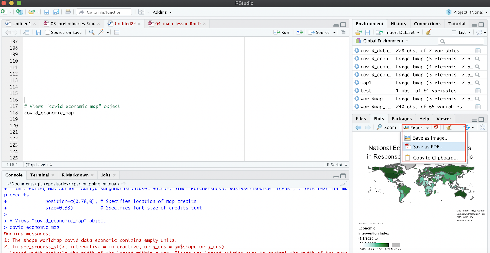

# Tutorial

```{r, include=FALSE}
library(tmap)
library(sf)
library(rnaturalearth)
library(rnaturalearthdata)
library(rgeos)
library(tidyverse)
library(readxl)
library(dplyr)
```

Now that we've taken care of these preliminary steps, we're ready to begin the tutorial. The steps in the tutorial below will walk through the process of creating world choropleth maps (both print and interactive) based on the dataset discussed in the previous section. 

## Load and View Data 

This subsection discusses how to load the tutorial data into our R environment. There are two pieces of data we'll need to load:

* The ICPSR tabular dataset on government policy responses to Covid-19 which we've already introduced
* A spatial dataset of world country boundaries; we will bring this dataset into R Studio via the ```ne_countries``` function of the *rnaturalearth* package

We will discuss how to import the ICPSR Covid-19 data in Section 4.1.1, and how to import the spatial dataset of world country boundaries via *rnaturalearth* in Section 4.1.2. 

### ICPSR Covid-19 Tabular Data

When importing tabular data that we have saved on our computer into R Studio, it's important to first understand some of the details of the data we're trying to import. The first thing to note is the type of file we're working with, which is indicated by the file extension; here, we can note that the ICPSR data's file extension ".xlsx", which indicates that it's an Excel file (but note that .xlsx files can also be opened in spreadsheet software programs other than Excel). 

As a result, we'll have to import this dataset into R Studio using a function designed specifically to handle Excel files. To that end, we'll use the ```read_excel``` function from the *readxl* package. Recall that if we want to learn more about a function or a package, it's possible to simply type a question mark followed by the package or function name in the console, and relevant information will appear in the "Help" tab of the "Files/Plots/Packages/Help/Viewer" window on the bottom right of the R Studio interface. For example, if we wanted to learn more about the ```read_excel```function, we could type ```?read_excel``` into the console, and view the documentation in the "Help" tab. 

Before using the ```read_excel``` function to bring the data into our R Studio environment, it could be helpful to inspect the data outside of the R environment, and determine whether the dataset has any features that we have to account for when loading it into our R environment. When we open the downloaded spreadsheet, it will look something like this:

```{r, echo=FALSE, results='asis', out.width='100%', fig.cap="ICPSR dataset in spreadsheet with description tab open", fig.alt="Screenshot of dataset's description tab opened in spreadsheet software; several variable definitions and descriptions are visible"}
knitr::include_graphics('images/excel_open.png')
```

Note that immediately after opening the spreadsheet, we will land on its first tab (or "sheet"), which is titled "Description". This part of the spreadsheet effectively functions as a data codebook, which we can look through to understand the dataset's various variables and and assess how they were measured. To open up the actual dataset, we can toggle to the "Dataset" tab by pressing the corresponding button on the bottom-left of the spreadsheet (highlighted in red below): 

```{r, echo=FALSE, results='asis', out.width='100%', fig.cap="ICPSR dataset open in spreadsheet software with dataset tab open", fig.alt="Screenshot of  dataset open in spreadsheet software with data displayed; dataset tab is active with with red box drawn around tabs on bottom of spreadsheet to show how to toggle between different sheets in spreadsheet software"}
knitr::include_graphics('images/excel_tabs.png')
```

The fact that the ICPSR dataset has two sheets within it is important; it means that when we load it into R, we'll have to explicitly specify the sheet (i.e. the "Dataset" sheet) that we want to import. 

Now, let's go ahead and load the "Dataset" sheet of the ICPSR data file into R Studio, using the following code:

```{r, echo=-1, eval=FALSE}
setwd("/Users/adityaranganath/Documents/git_repositories/icpsr_mapping_manual/tutorial_data")
# Loads ICPSR data into R Studio
read_excel("Gov_Responses2Covid19_last.xlsx", sheet="Dataset")
```

As we noted above, ```read_excel``` is the function used to bring in Excel spreadsheet data into R. The function has two arguments; the first (```Gov_Responses2Covid19_last.xlsx```) is the name of the file we want to import, while the second (```sheet="Dataset"```) establishes that we specifically want to import the the "Dataset" sheet from that Excel file.

If the importing process is successful, we will see the dataset print out into our R console. It will look something like this: 

```{r, echo=FALSE, comment=""}
setwd("/Users/adityaranganath/Documents/git_repositories/icpsr_mapping_manual/tutorial_data")
# Loads ICPSR data into R Studio
read_excel("Gov_Responses2Covid19_last.xlsx", sheet="Dataset")
```

Note that when printing a dataset to the console, R Studio will only display the first few records (i.e. rows) in the dataset, and won't display all of the fields (i.e. columns) either, but rest assured that all of the information has been imported (when printing to the console, R Studio usually truncates the data because of space constraints). 

The code above successfully imported the data into R Studio; however, in order to easily work with the data in a scripting environment, we need to assign the data to something called an object. 

To understand the concept of object assignment, consider the following simple example: 

```{r}
# assign value 5 to new object named x
x<-5
```

In the code above, we use R's assignment operator, ```<-```, to assign the value 5 to an object named "x." Now that an object named "x" has been created and assigned the value 5, printing "x" in our console (or printing "x" in our script and running it) will return the value 5: 

```{r, comment=""}
# View contents of object x
x
```

More generally, the process of assignment effectively equates the output created by the code on the right side of the assignment operator (```<-```) to an object with a name that is specified on the left side of the assignment operator. Whenever we want to look at the contents of an object (i.e. the output created by the code to the right side of the assignment operator), we simply print the name of the object in the R console (or print the name and run it within a script). 

While the example above was very simple, we can assign virtually any R code, and by extension, the data structure(s) generated by that code (such as datasets, maps, graphs) to an R object. Indeed, we'll use the basic principle of object assignment introduced above to assign our ICPSR dataset of interest to an object, which we will name "covid_data" (note that object names are arbitrary and could be virtually anything, but it is good practice for object names to describe their contents):

```{r, echo=-1}
setwd("/Users/adityaranganath/Documents/git_repositories/icpsr_mapping_manual/tutorial_data")
# Imports "Dataset" sheet from ICPSR Excel file into R Studio, and assigns the dataset to an object named "covid_data"
covid_data<-read_excel("Gov_Responses2Covid19_last.xlsx", sheet="Dataset")
```

The code above imports the dataset of interest using the code we used above (```read_excel("Gov_Responses2Covid19_last.xlsx", sheet="Dataset")```, but then takes the additional step of assigning the result of this expression (i.e. the imported ICPSR dataset) on the right side of the assignment operator to an object named ```covid_data```. In other words, the code assigns the output of the expression that results from running ```read_excel("Gov_Responses2Covid19_last.xlsx", sheet="Dataset")``` (i.e. the ICPSR dataset) to an object named ```covid_data```. 

We can confirm that the ICPSR dataset we imported has been assigned to an object named ```covid_data``` by typing and running ```covid_data``` in our script (or simply typing it into the console), and seeing that it prints the ICPSR dataset to our console:

```{r, comment=""}
# Prints contents of "covid_data" object to the console
covid_data
```

This suggests that once we've created an object through the assignment process discussed above, we can reference an object's contents by the object's name. For example, in this case, we can refer to the ICPSR Covid-19 data that has been assigned to the ```covid_data``` object as ```covid_data``` within our scripts and documentation. In other words, due to the assignment operation, R is able to recognize that whenever we mention ```covid_data```, we are referring to the underlying contents that have been assigned to the ```covid_data``` object (i.e. the ICPSR dataset). Throughout the tutorial, we'll sometimes use object names to refer to the  contents that they have been assigned; for instance, when we refer to ```covid_data``` or to the ```covid_data``` object, we are using shorthand for the ICPSR Covid-19 policy responses dataset that has been assigned to an object with this name. 

When we print ```covid_data``` in our console (or run it from our script), R will print only a snapshot of the ```covid_data``` object to the console. However, it will be useful to inspect the entire dataset of interest within the R interface (without having to open up Excel or other spreadsheet software). We can do so using the ```View``` function. In this case, to inspect the ICPSR dataset that we loaded into R Studio and assigned to ```covid_data```, we can pass ```covid_data``` as an argument to the ```View``` function:

```{r}
# Opens "covid_data" object in R Studio's data viewer
View(covid_data)
```

This will open up the dataset in R Studio's data viewer within a separate tab in the "Source" window. Within your R Studio environment, the result of running ```View(covid_data)``` will look something like this (dataset outlined in red):

```{r, echo=FALSE, results='asis', out.width='100%', fig.cap="Viewing ICPSR Dataset in R Studio Data Viewer", fig.alt="Screenshot of R Studio interface with covid_data object's contents displayed in R Studio Data Viewer; data viewer is outlined with a red rectangle"}
knitr::include_graphics('images/viewdata.png')
```

Note that it is possible to scroll up/down and across the dataset within the data viewer and explore its full dimensions (unlike when printing a dataset to the console). 

### Country Boundaries Spatial Data

Now that we have our tabular data on government responses to Covid-19 loaded into R Studio and assigned to the object named ```covid_data```, let's now turn to the process of bringing spatial data on world country borders into memory.

When working with spatial data in R, we will sometimes want to import data that is stored on our computer. There are several functions in the ```sf``` package that will allow us to easily import saved or downloaded spatial data into R; for more details, please  consult the package's documentation by typing ```?sf``` in the console. 

In our case, however, we won't have to download and import the spatial data we need into R Studio from our computer's local drive. That is because there are R packages that already provide this spatial data, and allow us to directly load it into memory. In particular, we'll use the ```ne_countries``` function of the *rnaturalearth* package to bring a spatial dataset of country borders into our R environment, and then assign it to an object that we will name ```country_boundaries```:

```{r}
# Brings spatial dataset of country boundaries into R environment using the rnaturalearth package, and then assigns this dataset to an object named "country_boundaries"
country_boundaries<-ne_countries(scale="medium", returnclass="sf")
```

Note the two arguments we pass to the ```ne_countries``` function: the ```scale``` argument specifies that we want to use a medium scale when rendering the map (the other options are 'small' and 'large'), while the ```returnclass``` argument specifies that we want the spatial dataset in 'sf' format, which is a spatial data format that works well with the *tmap* mapping package (which we'll introduce and use below).

Now that we have this spatial dataset in memory and assigned to a new object named ```country_boundaries```, let's step back and clarify what exactly a spatial dataset is. In some respects, a spatial dataset is like a typical tabular dataset. To see this, let's pass ```country_boundaries``` to the ```View()``` function to open up the dataset:

```{r}
# Opens contents of "country_boundaries" object in R Studio's data viewer
View(country_boundaries)
```

By scrolling across the dataset, we'll note that each row corresponds to a country, and that there are many columns that correspond to various country-level attributes. The crucial column, however, which makes this a spatial dataset (as opposed to merely a tabular one), is the information contained in a column called "geometry". This column contains geographic coordinate information that essentially defines a polygon for each country in the dataset. The "geometry" column is likely one of the last columns in the dataset, so we may have to scroll a bit to find it. Alternatively, we can use the ```relocate``` function in the *dplyr* package to make the "geometry" column the first column in ```country_boundaries```, and then view this reordered dataset using the ```View``` function. 

```{r}
# Moves "geometry" column to the beginning of the "country_boundaries" dataset
View(relocate(country_boundaries, geometry))
```

The first argument passed to the ```relocate``` function (```country_boundaries```) indicates the object we want to manipulate using the ```relocate``` function, while the second argument (```geometry```) indicates the name of the column in ```country_boundaries``` that we want to move up to the front of the dataset. Once that column relocation has taken place, the ```View``` function brings up the amended dataset as a new tab in the source window. It will look something like this (note the "geometry" column): 

```{r, echo=FALSE, results='asis', out.width='100%', fig.cap="Geometry Column Contains Spatial Information", fig.alt="Screenshot of spatial dataset in R Studio data viewer with geometry column moved to the front of the dataset; a red rectangle is drawn around the geometry column"}
knitr::include_graphics('images/geometry.png')
```

We can use the information in the "geometry" column to draw georeferenced polygons for each row in the spatial dataset, which will yield a world map! To translate the information in the geometry tab into a cartographic representation, we'll use a package called *tmap*. In particular, we'll use the ```tm_shape``` and ```tm_polygons``` functions from *tmap*, which are connected by a plus sign (+). The argument passed to the ```tm_shape``` function is the name of the object associated with the spatial dataset (```country_boundaries```, defined above). In addition, the ```tm_polygons``` function indicates that the spatial data is to be represented using polygons (as opposed to alternatives such as lines or points), and does not require any arguments. When we type in and run the following code from our script, the result is a map that is rendered based on the information in the "geometry" column of ```country_boundaries```:

```{r, fig.asp=0.5, echo=-1, message=FALSE, fig.alt="World map with countries colored gray; map is bordered with map frame"}
tmap_mode("plot")
# maps geographic features (i.e. countries) of "country_boundaries" using tmap package functions
tm_shape(country_boundaries)+
  tm_polygons()
```

We can assign this map, rendered from ```country_boundaries``` using *tmap*, to a distinct object, just as we assigned the tabular ICPSR dataset and the spatial dataset to distinct objects (```covid_data``` and ```country_boundaries```, respectively). Let's call this object ```worldmap```; the code below performs this assignment: 

```{r}
# assigns map of geographic features rendered from "country_boundaries" to a new object called "worldmap" 
worldmap<-tm_shape(country_boundaries)+
            tm_polygons()
```

Having assigned the map to the ```worldmap``` object, we can bring up the map whenever we want by simply calling the ```worldmap``` object (i.e. printing ```worldmap``` and running it from our script):

```{r, fig.asp=0.5, echo=-1, message=FALSE, fig.alt="World map with countries colored gray; map is bordered with map frame"}
tmap_mode("plot")
# displays contents of "worldmap" object (i.e. a country-level map generated from the "country_boundaries" spatial dataset)
worldmap
```

Within the R Studio interface, we can see the above map within the bottom-right window after selecting the "Plots" tab:

```{r, echo=FALSE, results='asis', out.width='100%', fig.cap="World Map in 'Plots' Tab (Rendered from Spatial Dataset)", fig.alt="Screen shot of world map rendered from spatial dataset displayed in R Studio's Plots tab; the map is bordered with a bounding box, and all countries are displayed in gray"}
knitr::include_graphics('images/worldmap_window.png')
```

We can enlarge the map in this window by clicking the "Zoom" link; this will produce an enlarged version of the map in a separate window:

```{r, echo=FALSE, results='asis', out.width='100%', fig.cap="Enlarging Map with 'Zoom' Button", fig.alt="Screen shot that shows enlarged world map rendered from spatial dataset in R Studio's zoom window; the zoom button is highlighted in red"}
knitr::include_graphics('images/zoom2.png')
```

## Edit Spatial Data

We can edit spatial datasets in R Studio with relative ease, using commonly-used R packages. Let's say, for example, that we don't want Antarctica to appear on our map (since Antarctica typically does not appear on political maps of the world). 

To delete Antarctica from the map, we first need to delete the row that corresponds to Antarctica in ```country_boundaries```. We can do so with the following code:

```{r}
# Deletes Antarctica from "country_boundaries"
country_boundaries<-country_boundaries %>% filter(iso_a3 !="ATA")
```

We can translate this code into ordinary language as follows: "Take the existing country boundaries dataset (```country_boundaries``` to the left of the ```%>%``` and to the right of the assignment operator) and then (``` %>% ```, a symbol called a pipe, which is used to chain together code) select only the countries that are not Antarctica (```filter(iso_a3 !="ATA"```). Take this amended (sans Antarctica) spatial dataset, and assign it back to an object named 'country_boundaries' (```country_boundaries<-```); this assignment effectively overwrites the previous dataset that was assigned to ```country_boundaries``` (which did include Antarctica) with the amended dataset." 

Two things may require additional elaboration:

* First is the pipe, the symbol that looks like this: ```%>%```. The pipe operator essentially takes the output of the code on its left, and then use that output as an input to the code on its right. Here, the pipe takes the ```country_boundaries``` object on its left, and then feeds this data into the ```filter``` function on its right. In other words, the pipe operator links the code on its two sides, and establishes that the data to be "filtered" within the ```filter``` function is ```country_boundaries```.
* The ```filter``` function  is a function from the *dplyr* package that allows one to select rows from a dataset using specified criteria. In our case, we want to select all rows from the dataset that are not Antarctica. The argument passed to the ```filter``` function, ```iso_a3 !="ATA"```, is essentially saying "return any records where the "iso_a3" variable (i.e. the 3 digit ISO country code) in the attribute table is NOT equal to "ATA" (Antarctica's code). Note that ```!=``` is R syntax for "not equal to".^[If we were to instead type ```filter(iso_a3=="ATA)```, the function would *only* select the Antarctica row from the dataset and discard everything else.]

Now, let's see this change reflected in the corresponding map. To do so, we must update the ```worldmap``` object by rerunning the object assignment. That is, ```worldmap``` will not automatically reflect the edits we just made to the ```country_boundaries``` dataset. We need to run the code again (with the new version of ```country_boundaries``` passed through the ```tm_shape``` function) and then assign the revised map to ```worldmap```, which effectively overwrites the previous map (the one with Antarctica) assigned to ```worldmap```:

```{r}
# Makes a new map based on the edited "country_boundaries" dataset, and assigns this new map to the "worldmap" object (thereby overwriting the map with Antarctica that was previously assigned to "worldmap")
worldmap<-tm_shape(country_boundaries)+
            tm_polygons()
```

Now, let's view our updated map:

```{r, fig.asp=0.5, echo=-1, message=FALSE, fig.alt="World map without Antarctica; countries are colored gray; map is bordered with map frame"}
tmap_mode("plot")
# Display contents of updated "worldmap" object
worldmap
```

As desired, Antarctica no longer appears on the map associated with "country_boundaries". 

## Process ICPSR Tabular Data for Mapping

In order to represent the ICPSR data on governments' economic responses to Covid-19 on a map, we must join the ICPSR dataset (```covid_data```) to the spatial dataset ( ```country_boundaries```); at that point, we'll have a new spatial dataset that will include the country-level Covid-19 data that we wish to map. We can then display the Covid-19 policy data on a map by using the ```tmap``` package that we have already introduced.

Before we can take those steps, however, we need to process the ICPSR tabular data with a view towards facilitating the joining and mapping process.

### Select Variables

When working with data in R, it is often useful to get a quick sense of a given dataset's dimensions, which we can do using the ```dim``` function. Below, we pass ```covid_data```  to the ```dim``` function:

```{r, comment=""}
# ascertain dimensions of "covid_data" object
dim(covid_data)
```

The output indicates that there are 62700 rows in the dataset, and 43 columns. This suggests that there are quite a few variables in the dataset, most of which we won't need. In particular, given that we're only interested in mapping (for now) the variable that represents an aggregate index of the generosity of governments' economic support measures in response to the pandemic, we'll go ahead and delete superfluous columns so as to keep the size of the final (joined) dataset tractable. The name of the variable we'd like to map, and therefore keep, is "Economic_Measure" (see the dataset's documentation for more details). In addition to keeping this variable, we also need to keep the column titled "iso", which is the 3-digit ISO country code; this ISO code also exists in the spatial dataset to which we want to join the "Economic_Measure" variable, and so we will use these ISO codes contained in the two datasets as the joining variable. 

Let's create this smaller dataset, comprised of the ISO code and the economic intervention index that we want to map, and assign it to a new object named "covid_data_economic": 

```{r}
# Select "iso" and "Economic_Measures" columns from "covid_data" dataset, and assign the dataset created through this selection to the "covid_data_economic" object
covid_data_economic<-covid_data %>% 
                      select(iso, Economic_Measures) 
```

The above code can be translated as follows: "Start with ```covid_data```, and then (``` %>% ```) keep the 'iso' and 'Economic_Measures' columns but discard everything else (````select(iso, Economic_Measures)```). Assign this new 2-column dataset to a new object called ```covid_data_economic``` (```covid_data_economic<-```)." We can take a look at this smaller dataset that was extracted from the original dataset by passing the ```covid_data_economic``` object as an argument to the now-familiar ```View``` function:

```{r, comment=""}
# View contents of "covid_data_economic" object in R Studio data viewer
View(covid_data_economic)
```

Within the "Source" window, a new tab that contains the smaller 2-column dataset that's been assigned to ```covid_data_economic``` will appear in the data viewer:

```{r, echo=FALSE, results='asis', out.width='100%', fig.cap='New Dataset Based on Selection from Original Dataset', fig.alt='Screenshot of contents of covid_data_economic object displayed in R Studio data viewer; the object is a two column dataset with one column containing information on ISO codes and the other containing the Economic_Measures data, i.e. the Covid economic index'}
knitr::include_graphics('images/selection.png')
```

Note that the original Covid-19 policy responses dataset, which we previously assigned to the ```covid_data``` object, is unaffected by our creation and assignment of a new dataset based on the selection of these two variables. We can confirm that this original data (```covid_data```) remains unaffected by inspecting it through a call to the ```View``` function:

```{r}
# View contents of "covid_data" object in R Studio data viewer
View(covid_data)
```

We can go back to the ```covid_data``` dataset anytime we need, but for now we'll set it aside and start working with our newly created ```covid_data_economic``` dataset.

### Change class of "Economic_Measures" Index

Recall that the data we want to map is contained within the "Economic_Measures" column of ```covid_data_economic```. R has six fundamental "types" of data: character, numeric, integer, logical, and complex. The code below extracts the "Economic_Measures" column from the dataset (placing a dollar sign in between the name of the object to which a dataset has been assigned, and the name of a column within that dataset, as in ```covid_data_economic$Economic_Measures```, is a way of isolating and extracting a column from a larger dataset), and then passes it to the ```class``` function to identify the class of the data in the "Economic_Measures" field. 

```{r, comment=""}
# Find the class of the "Economic_Measures" field within the "covid_data_economic" dataset
class(covid_data_economic$Economic_Measures)
```

We can see from the above output that the class of the "Economic_Measures" variable is "character", which implies that although the information in the "Economic_Measures" variable looks like it is numeric, R is not actually reading those data as numbers. So, we have to change the way in which that data is encoded, and ensure that it will be interpreted numerically; the failure to do this will prevent us from making numerical calculations using the information in this colum, as well as from mapping it using *tmap*. 

We can essentially recode the information in the "Economic_Measures" variable as "numeric" using the following expression: 

```{r}
# Changes class of "Economic_Measures" field in "covid_data_economic" object from character to numeric
covid_data_economic$Economic_Measures<-as.numeric(covid_data_economic$Economic_Measures)
```

In the code above, the expression to the right of the assignment operator extracts  the "Economic_Measures" column from the the ```covid_data_economic``` dataset (```covid_data_economic$Economic_Measures```), and then changes this column's class to numeric by passing it as an argument to the ```as.numeric``` function. The assignment operator then replaces the old version of the "Economic_Measures" column (encoded as character) within ```covid_data_economic```, with this new (numeric) version of the "Economic_Measures" column. At this point, the "Economic_Measures" column in ```covid_data_economic```  is numeric; we can confirm this by passing that column through the ```class``` function once again:

```{r, comment=""}
# Checks the class of the updated "Economic_Measures" field
class(covid_data_economic$Economic_Measures)
```

### Compute average of "Economic_Measures" index

As we mentioned earlier, the ICPSR dataset on government policies with respect to Covid-19 is a cross-sectional time-series (i.e. panel) dataset, containing monthly observations over the course of about a year during the pandemic (January 2020 to October 2020). This means that we have to make some choices about how to represent the "Economic_Measures" index on a map. For example, do we want to pick data for a given month, and then map this data? Do we want to use the map to represent change across different months? Do we want to map a summary measure of the "Economic_Measures" data, such as the average index value across all the months in the sample? 

There are of many possibilities, but let's choose to go ahead and map the country-level average for the "Economic_Measures" index across the entire time period covered in the dataset. That is, for each country, we'll compute the average value of the monthly observations for the "Economic_Measures" index, and then map this average value. To that end, we need to take ```covid_data_economic```, which contains monthly observations for each country, and collapse it into a new dataset that contains the country-level average of the "Economic_Measures" index. 

```{r, message=FALSE}
# Creates new dataset of country-level averages for "Economic_Measures" index, and then assigns this new dataset to a  new object that is named "covid_data_economic_avg". 
covid_data_economic_avg<-covid_data_economic %>% group_by(iso) %>% 
                                                summarize(mean_economic=mean(Economic_Measures, na.rm=TRUE))
```

Let's unpack the code above, starting with the expression that's to the right of the assignment operator. 

* We start by calling the ```covid_data_economic``` object, which establishes that this is essentially the "base" dataset we wish to modify. 
* Then (recall that the ``` %>% ``` is used to chain together code by taking the output on the left and passing it as input into the code to its right), we call the ```group_by``` function, and pass ```iso``` as an argument to this function; this stipulates that all observations with the same ISO code are to be considered a group, and that any subsequent calculations will therefore be performed at the country level. This step ensures that when we calculate the mean of the "Economic_Measures" variable, the function will return the mean value of this index for each individual country, rather than the mean value for the dataset as a whole. 
* After setting the grouping variable and using another pipe (``` %>% ```) to establish that we are passing the newly grouped dataset as an input into the subsequent code, we call the ```summarize``` function. This function is used to create a new dataset that summarizes an existing dataset with relevant summary statistics (such as the mean or standard deviation). In particular, within the ```summarize``` function, we first need to create a name for the column that will contain the country-level averages for the "Economic_Measures" index in the new dataset. We'll call this variable "mean_economic", which corresponds to the very first part of the argument to the ```summarize``` function. We then set this variable equal to an expression that passes the "Economic_Measures" variable to the ```mean``` function. In essence, this expression calculates the mean of the "Economic_Measures" variable for each country (it calculates the country-level mean because we specified the grouping function, ```group_by(iso)```, in the previous line of code), and creates a column in the newly created dataset named "mean_economic" to store this information. The code that reads ```na.rm=TRUE``` simply stipulates that missing data should be ignored in the calculation of the mean value of the "Economic_Measures" index. 
* Finally, this new dataset, consisting of two columns (one column containing ISO codes, and the other, named "mean_economic" containing the corresponding country-level mean of the "Economic_Measures" variable) is assigned to a new object called ```covid_data_economic_avg```. 

We can translate the above code as follows: "Take the existing ```covid_data_economic``` dataset, and then group this dataset by the ISO country codes; then, generate a new dataset, containing one column with ISO country codes, and another column, named "mean_economic", that contains information on the country-level mean of the 'Economic_Measures' index from the ```covid_data_economic``` dataset. Finally, assign this new dataset to an object called ```covid_data_economic_avg```". 

To inspect this new dataset within the Source window, simply pass ```covid_data_economic_avg``` to the ```View``` function. 

```{r}
# Views contents of "covid_data_economic_avg" dataset in R Studio data viewer
View(covid_data_economic_avg)
```

We should see something that looks like this: 

```{r, echo=FALSE, results='asis', out.width='100%', fig.cap="Dataset of Country-Level Averages for 'Economic_Measures' Index",fig.alt="Screenshot that shows contents of covid_data_economic_avg object in R Studio's data viewer; the object is a two-column dataset with one column containing 3-Digit ISO codes and the other containing the country level average of the Covid economic index; the column containing the country-level average is named mean_economic; the dataset in the data viewer is highlighted by a red rectangle" }
knitr::include_graphics('images/mean_economic.png')
```

### Calculate Summary Statistics

Now that we have a new dataset (```covid_data_economic_avg```) containing the country-level average of the "Economic_Measures" index, it can be useful to get a sense of how this data (which is the data we'd like to map) is distributed. We can easily do this by using the ```summary``` function, which returns a table of summary statistics for a specified variable. The following code produces summary statistics for the "mean_economic" variable contained in ```covid_data_economic_average``` (which is referred to as ```covid_data_economic$mean_economic```):

```{r, comment=""}
# Produces table of summary statistics for "mean_economic" variable contained in "covid_data_economic" dataset
summary(covid_data_economic_avg$mean_economic)
```

## Join Datasets

We're almost ready to map our data. But before doing that, we will have to join the ```covid_data_economic_avg``` object we just created to ```country_boundaries``` (i.e. the spatial dataset of country boundaries discussed earlier). In other words, before we can map our variable of interest on a world map, we must bring this variable into the spatially explicit ```country_boundaries``` dataset. 

The task of joining, or "merging" datasets is a very common procedure when working with social science data (or any data for that matter), since data is often held in many different locations, and must typically be brought together into a common dataset before it can be analyzed. That is essentially what we're doing here.

How do we join different datasets together? Associating two datasets into one larger dataset that combines information from both requires the datasets to share a common field; this common field can be used to essentially “glue” the datasets together. The International Organization for Standardization provides 3-digit country codes for each of the world’s countries that can be used to uniquely identify countries when working with country-level data. Both our spatial dataset (```country_boundaries```), and our dataset containing information on the "Economic_Measures" index averages (```covid_data_economic_avg```), contain fields with these standardized 3-digit ISO codes (this field is labelled “iso_a3” in the spatial dataset, and “iso” in the dataset containing the "Economic_Measures" average). We will therefore use the fields containing these 3-digit country codes to join ```covid_data_economic_avg``` to ```country_boundaries```:  

```{r}
# Join dataset with country-level means for the "Economic_Measures" index (i.e. "covid_data_economic") to spatial dataset of world boundaries  (i.e. "country_boundaries"), based on common 3-Digit ISO Codes; then, assign this dataset to an object named "covid_economic_spatial_dataset"
covid_economic_spatial_dataset<-full_join(country_boundaries, covid_data_economic_avg, by=c("iso_a3"="iso"))
```

In the code above, we use the ```full_join``` function to join ```covid_data_economic_avg``` to ```country_boundaries```. The ```full_join``` function keeps all rows (i.e. observations) from both datasets, even if one dataset has observations that another one does not (and vice-versa). For more information on different join options, explore the documentation by inspecting the function's documentation (```?full_join```). 

* The first argument to the ```full_join``` function is ```country_boundaries```, which is of course our spatial dataset.
* The second argument, ```covid_data_economic_avg``` is the tabular dataset containing information on country_level averages for the Covid economic intervention index (i.e. the data we ultimately want to map).^[It's worth noting that when we are joining a tabular dataset to a spatial dataset with a view towards visualizing the information within the tabular data on a map, the spatial dataset should be listed before the tabular dataset. If we reverse this order, we'll have to take some additional steps to get the joined dataset ready to map, and this is best avoided.] 
* The third argument specifies the join fields, i.e. the fields within the datasets that contain the common variable that can be used to correlate the records in the two different datasets and weld them together. In our case, the join variable is of course the 3-digit ISO country code. The argument that reads ```by=c("iso_a3"="iso")``` indicates that we want to join the datasets based on the set of country identifiers given by the 3-digit ISO codes; because the name of the column containing the 3-digit codes is different in the two datasets, the expression in the parentheses ```"iso_a3"="iso"``` simply indicates that the column named "iso_a3" (in the spatial dataset) and the column named (iso) in the tabular dataset are equivalent to each other, and are to be used as the join fields. If they didn't have different names--for example, if the ISO codes were in a column named "iso" in *both* datasets--we could simply have written ```by=iso``` to specify the join column.
* Finally, we take our newly created dataset, which adds the data we want to map our original spatial dataset (```country_boundaries```), and assign this value to a new object, named ```covid_economic_spatial_dataset```.  

We can translate the code in the previous code block as follows: "Join ```covid_data_economic_avg``` to ```country_boundaries``` using the fields with 3-digit country ISO codes as the join fields (the column with ISO information in the spatial dataset is named 'iso_a3' while the column with ISO information in the tabular dataset is 'iso'). Finally, assign the product of this join operation to a new object called ```covid_economic_spatial_dataset```"  

Before proceeding, let's take a quick look at our newly created joined dataset. To make it easy to inspect, we can move up the variables we're interested in (country name, the "mean_economic" variable, and the geometry information that makes the data spatial in nature) up to the front of the dataset:

```{r}
# Bring the "name", "mean_economic", and "geometry" fields/columns in "covid_economic_spatial_dataset" to the front of the dataset
covid_economic_spatial_dataset<-covid_economic_spatial_dataset %>% relocate(name, mean_economic, geometry)
```

After moving these fields by using the ```relocate``` function with the relevant fields as arguments, pass ```worldmap_covid_data_economic```, whose variables have now been relocated, to the familiar ```View``` function:

```{r}
# View the contents of the "covid_economic_spatial_dataset" in the R Studio data viewer
View(covid_economic_spatial_dataset)
```

The dataset that opens up in your Source window should look something like this:

```{r, echo=FALSE, results='asis', out.width='100%', fig.cap="Spatial Dataset With Covid-19 Economic Index Data", fig.alt="Screen shot with joined dataset displayed in R Studio data viewer; the first three columns are highlighted with a red rectangle. The first column contains country names, the second column contains the country-level average of the covid-economic index, and the third column contains geometry information that can be used to render countries as polygons using mapping tools"}
knitr::include_graphics('images/joineddataset.png')
```

Note that we now have a spatial dataset of country boundaries (as indicated by the "name" and "geometry" fields), with the data we want to map (the mean, for each country, of the Covid-19 Economic intervention index during the period under consideration) now included as a column within an expanded spatial dataset. 

## Make a Print Map

We're finally ready to represent our ICPSR data on a map! To do so, we'll use the *tmap* package, which we already used above to view a rendered version of our spatial dataset of country boundaries. Now, we'll take it a step further, and actually represent our data on the map features (i.e. the countries on the world map).  

### Make a Preliminary Map

Recall that as with with virtually anything else in R, we can assign maps created with the *tmap* package to objects, which makes it easy to subsquently reference our maps and customize them as needed. Below, we'll create a rough draft of a map and assign it to an object named ```covid_economic_map```:  

```{r, echo=-1, message=FALSE}
tmap_mode("plot")
# Creates map based on the data contained within the "mean_economic" field of "covid_economic"spatial_dataset", and assigns this map to a new object called "covid_economic_map"
covid_economic_map<-tm_shape(covid_economic_spatial_dataset)+
                      tm_polygons(col="mean_economic", 
                                  n=8, 
                                  style="jenks", 
                                  palette="BuGn")
```

Above, in the expression that is to the right of the assignment operator, we first use *tmap's* ```tm_shape``` function to specify the spatial dataset whose features we'd like to display. Within *tmap*, chaining together functions requires a ```+``` sign, so we add a ```+``` before moving to another function on the next line. This is the ```tm_polygons``` function, which we use because our spatial dataset of country boundaries represents those boundaries as polygons. Previously, we did not specify arguments to the ```tm_polygons``` function, but this function can take a variety of arguments that can help us to customize our map's appearance; we'll introduce a few more arguments below, but recall that if we want to see the full range of possible arguments, they are presented in the function's documentation (```?tm_polygons```). 

Now, let's consider the arguments that were passed to the ```tm_polygons``` function in the code above:

* ```col="mean_economic"``` specifies the name of the column in the spatial dataset (which has been specified as an argument to the ```tm_shape``` function) that contains the data we'd like to map. Recall from the previous section that the name of this column is "mean_economic." 
* ```n=8``` specifies that we want the data to be partitioned into 8 bins 
* ```style="jenks"``` indicates that we want to set break points in the data distribution using the Jenks Natural Breaks Classification; to see other options for partitioning your data, see the function's documentation. For more information on the Jenks Natural Breaks Classification, as well as other data partition algorithms, see [here](https://pro.arcgis.com/en/pro-app/2.7/help/mapping/layer-properties/data-classification-methods.htm). 
* ```palette="BuGn"``` specifies the color scheme that we want to use to represent the data. Check out this extremely useful [guide](https://www.nceas.ucsb.edu/sites/default/files/2020-04/colorPaletteCheatsheet.pdf) on colors and palettes in R (including information on relevant color codes). "BuGn" refers to a blue-green color gradient, which we will use to represent country-level variation in the Covid economic index. 

To see what the map looks like, simply print ```covid_economic_map``` and run it in the script:

```{r, fig.asp=0.5, message=FALSE, warning=FALSE, fig.alt="Choropleth world map showing variation in country-level average of covid economic intervention index; green color scheme ranging from lighter shades of green to represent lower values of the index and darker shades of green to represent higher values; countries without data are filled in with gray The map legend is on the top right of the map superimposed over the Asia pacific, with some countries obscured by the legend. The legend is vertically oriented, and presents 8 discrete class breaks in the data. The map is bounded by a map frame that is drawn around it", echo=-1}
tmap_mode("plot")
# display contents of "covid_economic_map"
covid_economic_map
```

As in Section 4.1.2 above, we can see the map in the "Plots" tab of the bottom-right window, and can open up a larger window by clicking the "Zoom" button right below the "Plots" tab.

Of course, the map we've just created needs a bit of work (most noticeably, the legend needs to be moved to a less distracting location), but after all of the previous work to set up our data, hopefully it feels exciting to finally see our tabular data transformed into a map!

Before we work on the legend, let's see how to change certain features of the map using arguments to the ```tm_polygons``` function that we've already discussed. For instance, let's say we want a Yellow to Red palette ("YlOrRd"; again, remember you can look up these codes at the color guide linked above), only five intervals for the data, and want the data to be equally partitioned across intervals (rather than by using the Jenks algorithm). We'll assign this modified map to a new object, titled ```covid_economic_map_alternative```. 

```{r, echo=-1, message=FALSE}
tmap_mode("plot")
# Modifies the appearance of "covid_economic_map" and assigns this modified map to a new object named "covid_economic_map_alternative"
covid_economic_map_alternative<-tm_shape(covid_economic_spatial_dataset)+
                                  tm_polygons(col="mean_economic", 
                                              n=5, 
                                              style="equal",
                                              palette="YlOrRd")
```

Let's display this map and view its appearance; notice the change in color, the fewer number of classes, and the equal intervals in the legend: 

```{r a, fig.asp=0.5, message=FALSE, warning=FALSE, echo=-1, fig.alt="Choropleth world map showing variation in country-level average of covid economic intervention index; yellow to dark red color scheme ranging from lighter shades of yellow to represent lower values of the index and darker shades of red to represent higher values; countries without data are filled in with gray The map legend is on the top right of the map superimposed over the Asia pacific, with some countries obscured by the legend. The legend is vertically oriented, and presents 5 discrete class breaks in the data. The map is bounded by a map frame that is drawn around it"}
tmap_mode("plot")
# Displays contents of "covid_economic_map_alternative"
covid_economic_map_alternative
```

Also, that depending on our preferences, we can easily remove the map frame, by using the "Frame" argument within the ```tm_layout``` function: 

```{r b, fig.asp=0.5, message=FALSE, warning=FALSE, echo=-1, fig.alt="Choropleth world map showing variation in country-level average of covid economic intervention index; yellow to dark red color scheme ranging from lighter shades of yellow to represent lower values of the index and darker shades of red to represent higher values; countries without data are filled in with gray The map legend is on the top right of the map superimposed over the Asia pacific, with some countries obscured by the legend. The legend is vertically oriented, and presents 5 discrete class breaks in the data. The map is not bounded by a map frame that is drawn around it"}
tmap_mode("plot")
# Removes frame from "covid_economic_map_alternative" map
covid_economic_map_alternative<-tm_shape(covid_economic_spatial_dataset)+
                                 tm_polygons(col="mean_economic", 
                                             n=5, 
                                             style="equal", 
                                             palette="YlOrRd")+
                                 tm_layout(frame=FALSE)

# Displays amended contents of "covid_economic_map_alternative" object (i.e. map without a frame)
covid_economic_map_alternative
```

### Customize Legend

The biggest issue with the rough drafts of our map from the previous subsection is the position of the legend. Let's go back to the first map we made (```covid_economic_map```), and simply switch its legend position, by specifying ```position=c("left","bottom")``` withing the ```tm_legend``` function: 

```{r c, fig.asp=0.5, message=FALSE, warning=FALSE, echo=-1, fig.alt="Choropleth world map showing variation in country-level average of covid economic intervention index; green color scheme ranging from lighter shades of green to represent lower values of the index and darker shades of green to represent higher values; countries without data are filled in with gray The map legend is on the bottom-left of the map, positioned to the left of South America. The legend is vertically oriented, and displays 8 discrete intervals for the data. There is no map frame drawn around the map."}
tmap_mode("plot")
# Shifts legend position using the "tm_legend" function, and assigns amended map to "covid_economic_map"
covid_economic_map<-tm_shape(covid_economic_spatial_dataset)+
                      tm_polygons(col="mean_economic", 
                                  n=8, 
                                  style="jenks", 
                                  palette="BuGn")+
                      tm_layout(frame=FALSE)+
                      tm_legend(position=c("left", "bottom"))

# Views amended contents of  "covid_economic_map"
covid_economic_map
```

Currently, our legend is discrete, but we may want to try using a continuous legend to better match the continuous nature of the index (for more on discrete breaks vs continuous gradients, see [here](https://developers.arcgis.com/javascript/latest/visualization/best-practices/classed-vs-continuous/). We can do this by setting ```style="cont``` within the ```tm_polygons``` function:

```{r d, fig.asp=0.5, message=FALSE, warning=FALSE, echo=-1, fig.alt="Choropleth world map showing variation in country-level average of covid economic intervention index; green color gradient ranging from lighter shades of green (at the top of the legend bar) to represent lower values of the index and darker shades of green (at the bottom of the legend bar) to represent higher values. Countries without data are filled in with gray The map legend is a vertical bar that displays values using a continuous gradient, with the default-chosen numbers 0, 0.2, 0.4., and 0.6 arrayed next to the gradient to help inform the viewer about the data distribution. The legend is displayed on the bottom-left of the map next to South America, with the legend title positioned over the vertical color gradient. There is no map frame surrounding the map"}
tmap_mode("plot")
# Changes "style" argument parameter within "tm_polygons" function to "cont" to make continuous legend and assigns amended map to "covid_economic_map" (thereby overwriting the previous contents of "covid_economic_map)
covid_economic_map<-tm_shape(covid_economic_spatial_dataset)+
                      tm_polygons(col="mean_economic", 
                                  style="cont", 
                                  palette="BuGn")+
                      tm_layout(frame=FALSE)+
                      tm_legend(position=c("left", "bottom"))

# Display amended map
covid_economic_map
```

Let's explore some additional ways to customize our legend:

* Notice that the legend has a "Missing" category, to indicate countries for which we don't have data on the Covid-19 economic index. Instead of labelling it "Missing" we'll' label it as "No Data".
* Let's give the legend a title that describes the data: "Mean of Covid Economic Intervention Index (1/1/2020 to 10/1/2020)".
* It's possible to experiment with different legend orientations. To see this, let's flip the legend's orientation, turning it into a horizontal rather than vertical bar.
* It's also possible to specify our own intervals for the legend; we'll set our legend breaks at 0, 0.25, 0.5, and 0.72.
* We'll customize the size of our legend, as well as the legend's text. 
* We'll alter the location of our legend, placing it outside the map's bounding box (as defined by the now-invisible map frame) 

The following code incorporates these changes into the previous map:

```{r e, fig.asp=0.5, message=FALSE, warning=FALSE, echo=-1, fig.alt="Choropleth world map showing variation in country-level average of covid economic intervention index; green color scheme ranging from lighter shades of green to represent lower values of the index and darker shades of green to represent higher values; countries without data are filled in with gray The map legend is a horizontal bar that displays values using a continuous color gradient with custom-chosen numbers arrayed below the gradient to help inform the viewer about the data distribution. The legend is displayed on the bottom-left of the map below and to the left of South America and is titled 'Mean of Covid Economic Intervention Index (1/1/2020 to 10/1/2020)'; the legend title is in bold and placed over the horizontal legend bar. There is no map frame surrounding the map."}
tmap_mode("plot")
# Adds additional customizations to legend and assigns amended map to "covid_economic_map" (thereby overwriting the object's previous contents)
covid_economic_map<- tm_shape(covid_economic_spatial_dataset)+
                      tm_polygons(col="mean_economic", 
                                  style="cont", 
                                  palette="BuGn", 
                                  textNA="No Data", 
                                  title="Mean of Covid\nEconomic\nIntervention Index\n(1/1/2020 to\n 10/1/2020)", 
                                  legend.is.portrait=FALSE,
                                  breaks=c(0,0.25,0.5, 0.72))+
                      tm_layout(legend.title.size=0.7, 
                                legend.title.fontface=2,
                                legend.outside=TRUE,
                                legend.outside.position = c("bottom"), 
                                frame=FALSE, 
                                legend.text.size = 0.5,
                                legend.width = 0.35)

# Displays updated contents of "covid_economic_map"
covid_economic_map
```

Let's unpack this code; for the sake of completeness, we'll go over all of the functions and arguments, rather than just the code that implements the changes mentioned above. 

Above, to the right of the assignment operator, we have:

* ```tm_shape(covid_economic_spatial_dataset)``` specifies the spatial dataset that contains the information we want to map.
* The ```tm_polygons``` function takes many arguments here:
  * ```col="mean_economic"``` specifies the name of the column in ```covid_economic_spatial_dataset``` that contains the data we wish to map. 
  * ```style=cont``` indicates that we want a continuous legend
  * ```palette="BuGn"``` specifies the color scheme we wish to use to represent variation in the data.
  * ```textNA="No Data``` indicates that we want data coded as "NA" to be labeled "No Data" in our legend; the default label is "Missing"
  * ```title="Mean of Covid\nEconomic\nIntervention Index\n(1/1/2020 to\n 10/1/2020)"``` specifies the title of the legend. The ```\n``` notation is used to indicate line breaks. If these are not included, the legend title would not contain line breaks, and would be one line. .
  * ```legend.is.portrait=FALSE``` flips the legend, making its orientation horizontal rather than vertical
  * ```breaks=c(0,0.25,0.5,0.72)``` specifies our custom breaks (for values of the Covid economic index) in the legend. 
* The ```tm_layout``` function also takes many arguments:
  * ```legend.title.size=0.7``` sets the size of the text in the legend's title
  * ```legend.title.fontface=2``` makes the legend title bold. 
  * ```legend.outside=TRUE``` specifies that the legend is to be situated outside the (invisible) map frame; this prevents the legend from blocking out portions of the map itself
  * ```legend.outside.position = c("bottom")``` positions the legend below the southern border of the (invisible) map frame
  * ```frame=FALSE``` makes the map frame invisible, so that we don't see a border surrounding the countries
  * ```legend.text.size=0.5``` specifies the size of the legend text that is not part of the legend title
  * ```legend.width=0.35``` specifies the width of the legend

The best way to get a sense of how all of these various arguments work is to change the values of the arguments and then inspect their effect on the map's appearance. You will have an opportunity to try this in Practice Exercise 1 below (Section 5.1)

### Add Map Title and Credits

One useful thing to keep in mind is that when adding new elements to our map, it's not necessary to retype all of our code; thus far, that is what we've been doing, but it's also possible to simply append changes to an existing object. Below, to the right of the assignment operator, we first print the name of the object we want to modify (i.e. ```covid_economic_map```) and then type a "+" sign; then, we can modify the object as desired through the use of relevant functions, and then save those changes by assigning the map back to ```covid_economic_map```. In particular, we want to add and customize a map title (which we will do by passing a few additional arguments to the now-familiar ```tm_layout``` function), as well as add and customize a "Map Credits" section, which will include some basic map metadata. 

```{r f, message=FALSE, warning=FALSE, echo=-1, fig.alt="Choropleth world map showing variation in country-level average of covid economic intervention index; green color scheme ranging from lighter shades of green to represent lower values of the index and darker shades of green to represent higher values; countries without data are filled in with gray The map legend is a horizontal bar that displays values using a continuous color gradient with custom-chosen numbers arrayed below the gradient to help inform the viewer about the data distribution. The legend is displayed on the bottom-left of the map below and to the left of South America and is titled 'Mean of Covid Economic Intervention Index (1/1/2020 to 10/1/2020)'; the legend title is in bold and placed over the horizontal legend bar. There is no map frame surrounding the map. The map's title is 'Scope of National Economic Support Measures in Response to the Covid-19 Pandemic', which is split into two lines and centered at the top of the map above the northern-most countries. The map credits are split across four lines, and printed on the bottom-right of the map below Australia and New Zealand."}
tmap_mode("plot")
# Adds map credits and title to existing "covid_economic_map" object, and then assigns this amended map back to "covid_economic_map" (thereby overwriting the map that was previously assigned to this object)
covid_economic_map<-covid_economic_map+
                       tm_layout(main.title="Scope of National Economic Support Measures\nin Response to the Covid-19 Pandemic", 
                                 main.title.position="center",
                                 main.title.size=1, 
                                 inner.margins=c(0.06,0.10,0.10,0.08), 
                                 attr.outside = TRUE)+
                        tm_credits("Map Author: Aditya Ranganath\nDataset Author: Simon Porcher\nCRS: WGS1984\nSource: ICPSR", 
                                   position=c(0.78,0), 
                                   size=0.38)

# Display the amended "covid_economic_map" object
covid_economic_map 

```

Let's consider the new arguments passed through the ```tm_layout``` and ```tm_credits``` function:

* ```tm_layout```
  * ```main.title="Scope of National Economic Support Measures\nin Response to the Covid-19 Pandemic"``` specifies the title for the map as a whole. As before ```\n``` specifies line breaks. 
  * ```main.title.position="center"``` specifies the justification of the title
  * ```main.title.size=1``` specifies the font size of the title
  * ```inner.margins=c(0.06,0.10,0.10,0.08)``` establishes the size of the margins within the map frame. Its most noticeable impact in this context is to regulate the whitespace between the title and the map features. 
  * ```attr.outside = TRUE```, in this context, places the map credits (one of the map's attributes), outside the map frame
* The ```tm_credits``` function is a function used to choose the content and appearance of the map's credits section.
  * ```"Map Author: Aditya Ranganath\nDataset Author: Simon Porcher\nCRS: WGS1984\nSource: ICPSR``` is the text of the credits section; as before, ```\n``` specifies line breaks
  *  ```position=c(0.78,0)``` specifies the location of the credits
  * ```size=0.38``` specifies the size of the text in the credits section

It's worth emphasizing that when working on your these maps, a lot of trial-and-error is usually required in order to determine the values for the various function arguments that will yield a map with the desired appearance. In addition, there are a lot of *tmap* functions and arguments that we haven't covered; be sure to explore all the possibilities  by exploring *tmap's* documentation (```?tmap```)

### Final Map Code

For convenience, here's all of the code that we used to construct the map we arrived at in the previous section, along with comments summarizing what each line is doing:

```{r g, message=FALSE, warning=FALSE, echo=-1, fig.alt="Choropleth world map showing variation in country-level average of covid economic intervention index; green color scheme ranging from lighter shades of green to represent lower values of the index and darker shades of green to represent higher values; countries without data are filled in with gray The map legend is a horizontal bar that displays values using a continuous color gradient with custom-chosen numbers arrayed below the gradient to help inform the viewer about the data distribution. The legend is displayed on the bottom-left of the map below and to the left of South America and is titled 'Mean of Covid Economic Intervention Index (1/1/2020 to 10/1/2020)'; the legend title is in bold and placed over the horizontal legend bar. There is no map frame surrounding the map. The map's title is 'Scope of National Economic Support Measures in Response to the Covid-19 Pandemic', which is split into two lines and centered at the top of the map above the northern-most countries. The map credits are split across four lines, and printed on the bottom-right of the map below Australia and New Zealand."}
tmap_mode("plot")
covid_economic_map<-                      # assigns map to object named "covid_econonmic_map"
tm_shape(covid_economic_spatial_dataset)+ # Specifies Spatial Dataset
  tm_polygons(col="mean_economic",      # Specifies column we want to map
              style="cont",             # Specifies continuous legend
              palette="BuGn",           # Specifies color palette/scheme to represent data variation
              textNA="No Data",         # Codes "NA" values as "No Data" in the legend
              title="Mean of Covid\nEconomic\nIntervention Index\n(1/1/2020 to\n 10/1/2020)", # Sets legend title
              legend.is.portrait=FALSE, # Makes legend horizontal
              breaks=c(0,0.25,0.5, 0.72))+ # Sets legend breaks
  tm_layout(legend.title.size=0.7,      # Sets legend title size
            legend.title.fontface=2,    # Makes legend bold
            legend.outside=TRUE,        # Puts legend outside map frame
            legend.outside.position=c("bottom"), # Puts legend below map frame
            frame=FALSE,                # Makes map frame invisible                         
            legend.text.size = 0.5,     # Sets size of legend tex
            legend.width=0.35,          # Sets legend width
            main.title="Scope of National Economic Support Measures\nin Response to the Covid-19 Pandemic", # Sets map title
            main.title.position="center", # Specifies title justification
            main.title.size=1,          # Specifies title font size
            inner.margins=c(0.06,0.10,0.10,0.08), # Sets map margins with respect to frame
            attr.outside = TRUE)+       # Places map credits outside frame
  tm_credits("Map Author: Aditya Ranganath\nDataset Author: Simon Porcher\nCRS: WGS1984\nSource: ICPSR", # Sets text for map credits
             position=c(0.78,0), # Specifies location of map credits
             size=0.38)          # Specifies font size of credits text

# Displays "covid_economic_map" object
covid_economic_map
```

## Export Map

Once we're done customizing our map, we can copy it to our clipboard (and paste it elsewhere), export it as an image file (i.e. png or jpeg), or export it as a PDF; we can either do this programatically using a built-in *tmap* function, or we can do it through the R Studio GUI. 

### Export Map Using *tmap*

To export maps programmatically, we can use the ```tmap_save``` function. The first argument to this function should be the name of map object we want to export (here, ```covid_economic_map```); the second should be the file name, including the extension, of the file to which we want to save the map object. If, for example, we wanted to save a png file with the name "covid_economic_map_export", this second argument would be "covid_economic_map_export.png". This is all we need in order to export the map (which will be saved in our working directory), but the ```tmap_save``` function allows several other arguments that you can learn about by inspecting the function's documentation (```?tmap_save```). The only other arguments we'll use are the "width" and "height" arguments, which allow us to specify the dimensions of the exported map (in pixels). We'll export a map with width of 1920 pixels, and a height of 1080 pixels. 

The first code block below writes ```covid_economic_map``` as a png file (with dimensions of 1920 x 1080 pixels) to our working directory; the subsequent two blocks write the object as jpeg and PDF files, respectively. 

PNG File
```{r h, warning=FALSE, message=FALSE, eval=FALSE}
# Saves contents of "covid_economic_map" object as png file to working directory with resolution of 1920 by 1080 pixels
tmap_save(covid_economic_map, "covid_economic_map_export.png", width=1920, height=1080)
```

JPEG File
```{r, warning=FALSE, message=FALSE, eval=FALSE}
# Saves contents of "covid_economic_map" object as jpeg file to working directory with resolution of 1920 by 1080 pixels
tmap_save(covid_economic_map, "covid_map.jpeg", width=1920, height=1080)
```

PDF File
```{r, warning=FALSE, message=FALSE, eval=FALSE}
# Saves contents of "covid_economic_map" object as pdf file to working directory with resolution of 1920 by 1080 pixels
tmap_save(covid_economic_map, "covid_map.pdf", width=1920, height=1080)
```

Once we've exported the map to our working directly in the format we'd like, we can open up the file on our computer. The PNG file will look something like this: 

```{r, echo=FALSE, results='asis', out.width='100%', fig.cap='Map Exported as Image File', fig.alt='Screenshot of final covid_economic_map object as PNG image file that was exported from R Studio; appearance of the map is the same as the map created and described in Section 4.5.4'}
knitr::include_graphics('images/covid_economic_map_export.png')
```

### Export Map Through GUI

It's also possible to export our map in the desired file format by using the "Export" menu bar within the "Plots" tab on the bottom-right of our R Studio interface. Click the "Export" button, and select one of the three options; from there, things should be self-explantory.

```{r, echo=FALSE, results='asis', out.width='100%', fig.cap="Export Map Using R Studio GUI", fig.alt="Screenshot demonstrating how to export map as image file using R Studio's GUI; red rectangle around the export button located in the bottom-right of the R Studio interface"}

```

## Summary 

After working through the tutorial, it can be useful to see the essential steps required to generate our final map a in a self-contained script that summarize all of the steps we took above. Section 4.8.1. presents a summary version of our  map script. Note that the summary script below presupposes that we are in the correct working directory (i.e. the working directory which contains the ICPSR data we downloaded as an Excel file; see Section 3.6), and that all the required libraries are loaded (see Section 3.5)

### Print Map Summary Script

```{r, message=FALSE, warning=FALSE, echo=c(-1,-2,-3), fig.alt="Reproduces map created in lesson and generated through summary script. Choropleth world map showing variation in country-level average of covid economic intervention index; green color scheme ranging from lighter shades of green to represent lower values of the index and darker shades of green to represent higher values; countries without data are filled in with gray The map legend is a horizontal bar that displays values using a continuous color gradient with custom-chosen numbers arrayed below the gradient to help inform the viewer about the data distribution. The legend is displayed on the bottom-left of the map below and to the left of South America and is titled 'Mean of Covid Economic Intervention Index (1/1/2020 to 10/1/2020)'; the legend title is in bold and placed over the horizontal legend bar. There is no map frame surrounding the map. The map's title is 'Scope of National Economic Support Measures in Response to the Covid-19 Pandemic', which is split into two lines and centered at the top of the map above the northern-most countries. The map map credits are split across four lines, and printed on the bottom-right of the map below Australia and New Zealand. "}

tmap_mode("plot")
setwd("/Users/adityaranganath/Documents/git_repositories/icpsr_mapping_manual/tutorial_data")
# Imports "Dataset" sheet from ICPSR Excel file into R Studio, and assigns the dataset to an object called "covid_data"
covid_data<-read_excel("Gov_Responses2Covid19_last.xlsx", sheet="Dataset")

# Brings spatial dataset of country boundaries into R environment using the rnaturalearth package and assigns it to object named "country_boundaries"
country_boundaries<-ne_countries(scale="medium", returnclass="sf")

# Deletes Antarctica from "country_boundaries" object
country_boundaries<-country_boundaries %>% filter(iso_a3 !="ATA")

# Selects "iso" and "Economic_Measures" variables from ICPSR Dataset, and assigns this new dataset to object named "covid_data_economic" 
covid_data_economic<-covid_data %>% 
                      select(iso, Economic_Measures) 

# Changes class of "Economic_Measures" field in "covid_data_economic" object from character to numeric
covid_data_economic$Economic_Measures<-as.numeric(covid_data_economic$Economic_Measures)

# Calculates Country-Level Averages for "Economic_Measures" Index, and then assigns this dataset of country-level averages to a new object called "covid_data_economic_avg". 
covid_data_economic_avg<-covid_data_economic %>% group_by(iso) %>% 
                                                summarize(mean_economic=mean(Economic_Measures, na.rm=TRUE))

# Joins dataset containing information on country-level means for "Economic_Measures" index (in "covid_data_economic" object) to spatial dataset of world boundaries (in "country_boundaries" object), based on common 3-Digit ISO Codes and assigns the dataset that results from this join to "covid_economic_spatial_dataset"
covid_economic_spatial_dataset<-full_join(country_boundaries, covid_data_economic_avg, by=c("iso_a3"="iso"))

# Make static map using data in "covid_economic_spatial_dataset" and assigns the map to object called "covid_economic_map"
covid_economic_map<-  
tm_shape(covid_economic_spatial_dataset)+ # Specifies Spatial Dataset containing data we want to map
  tm_polygons(col="mean_economic",      # Specifies column we want to map
              style="cont",             # Specifies continuous legend
              palette="BuGn",           # Specifies color palette/scheme to represent data variation
              textNA="No Data",         # Codes "NA" values as "No Data" in the legend
              title="Mean of Covid\nEconomic\nIntervention Index\n(1/1/2020 to\n 10/1/2020)", # Sets legend title
              legend.is.portrait=FALSE, # Makes legend horizontal
              breaks=c(0,0.25,0.5, 0.72))+ # Sets legend breaks
  tm_layout(legend.title.size=0.7,      # Sets legend title size
            legend.title.fontface=2,    # Makes legend bold
            legend.outside=TRUE,        # Puts legend outside map frame
            legend.outside.position=c("bottom"), # Puts legend below map frame
            frame=FALSE,                # Makes map frame invisible                         
            legend.text.size = 0.5,     # Sets size of legend tex
            legend.width=0.35,          # Sets legend width
            main.title="Scope of National Economic Support Measures\nin Response to the Covid-19 Pandemic", # Sets map title
            main.title.position="center", # Specifies title justification
            main.title.size=1,          # Specifies title font size
            inner.margins=c(0.06,0.10,0.10,0.08), # Sets map margins with respect to frame
            attr.outside = TRUE)+       # Places map credits outside frame
  tm_credits("Map Author: Aditya Ranganath\nDataset Author: Simon Porcher\nCRS: WGS1984\nSource: ICPSR", # Sets text for map credits
             position=c(0.78,0), # Specifies location of map credits
             size=0.38)          # Specifies font size of credits text

# Views "covid_economic_map" object
covid_economic_map

```


