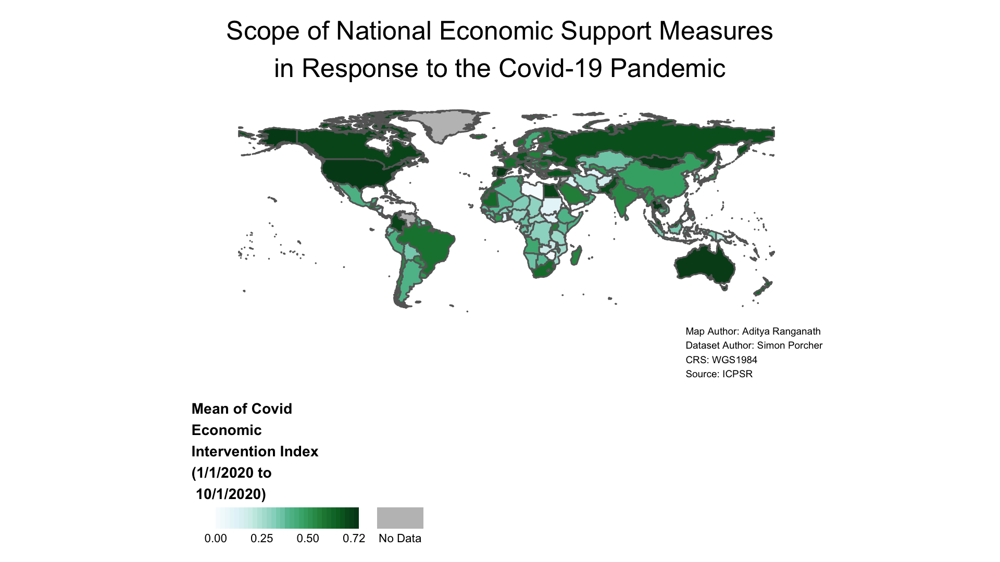

# Conclusion

Congratulations on finishing the tutorial and the exercises! This section concludes and offers suggestions on further reading and useful resources to consult.

## Wrapping Up

We started the tutorial with a tabular dataset archived on ICPSR. That dataset provides crossnational information on governments' public health and economic policies in response to the Covid-19 pandemic. When we first opened the dataset after downloading it from the ICPSR landing page, it looked something like this:

```{r, echo=FALSE, results='asis', out.width='100%', fig.cap='The Original ICSPR Dataset in Excel', fig.alt='Screenshot of original ICPSR dataset displayed in spreadsheet software with the dataset tab open and showing rows and columns of data'}

```

There were no maps or visualizations provided with the original ICPSR dataset, but with a bit of work in R Studio, we used the information in the dataset to generate and export a choropleth map that looked something like this: 

```{r, echo=FALSE, results='asis', out.width='100%', fig.cap='Map Based on Variable in ICPSR Dataset', fig.alt="Screenshot of map created and exported in tutorial; the appearance of the map is identical to the one generated in Section 4.5.4 of the tutorial. It is a choropleth world map showing variation in the country-level average of the covid economic intervention index; green color scheme ranging from lighter shades of green to represent lower values of the index and darker shades of green to represent higher values; countries without data are filled in with gray The map legend is a horizontal bar that displays values using a continuous color gradient with custom-chosen numbers arrayed below the gradient to help inform the viewer about the data distribution. The legend is displayed on the bottom-left of the map below and to the left of South America and is titled 'Mean of Covid Economic Intervention Index (1/1/2020 to 10/1/2020)'; the legend title is in bold and placed over the horizontal legend bar. There is no map frame surrounding the map. The map's title is 'Scope of National Economic Support Measures in Response to the Covid-19 Pandemic', which is split into two lines and centered at the top of the map above the northern-most countries. The map credits are split across four lines, and printed on the bottom-right of the map below Australia and New Zealand."}

```

This illustrates an important point: when exploring ICPSR data, we're not limited to the materials provided by the author of a given dataset. We have the power to take this archived data, and represent it in novel ways that might further our understanding of the topics that we're interested in. In the most general terms, this tutorial was fundamentally about how to go about this process in the context of spatial visualization. More specifically, we learned more about how to put archived ICPSR data stored in tabular datasets into geographic context by representing the information they contain on a map. Every dataset has its idiosyncrasies, but the general workflow we developed here is quite portable; as Practice Exercise 3 demonstrated, the workflow and code we developed in the tutorial can, with a bit of tinkering, be adapted to other ICPSR datasets as well.

## Useful Reading and Resources

The choropleth maps we generated were fairly basic, and could be refined or made made more aesthetically pleasing. They could also be made more sophisticated, through techniques like inserting inset maps. If you would like to further develop your spatial visualization and mapping skills, an excellent place to start is with the free and open-source book by Lovelace, Nowosad, and Muenchow (2021), entitled [*Geocomputation with R*](https://geocompr.robinlovelace.net/index.html). The book is more than an introduction to making maps; it's a comprehensive guide to spatial analysis and Geographic Information Systems more generally. 

## Final Considerations 

Finally, our focus in this tutorial was on generated choropleth world maps using ICPSR datasets. Of course, ICPSR has data at different geographic scales, and has a particularly large collection of United States-specific data. If you're interested in making a map of US-specific ICPSR data, the *usaboundaries* package allows you to import a variety of spatial datasets corresponding to different US geographic divisions (i.e. state, county, zip codes etc.). You could join tabular ICPSR data to these spatial datasets in order to visualize them on a map, using a process that is similar to the one presented in this tutorial. Documentation for the *usaboundaries* package is available [here](https://cran.r-project.org/web/packages/USAboundaries/USAboundaries.pdf). It's important to note, however, that in certain cases, particularly when working with spatial data at finer scales, privacy and disclosure concerns (that do not arise in the context of aggregate global data) might become salient. It is therefore important to be sensitive to the ethical issues that might arise in the context of a given spatial project. If you would like to learn more about such issues, Haley et al (2016) provide a useful guide in the context of a discussion of geographically-explicit health data in public health studies. 

## Acknowledgement

The repository used to initially create this teaching resource was generated from a bookdown template that is available here: 
[https://github.com/jtr13/bookdown-template](https://github.com/jtr13/bookdown-template). 

## References

Bivand, Roger and Colin Rundel. 2020. "rgeos: Interface to Geometry Engine-Open Source ('GEOS')". *R Package Version 0.5-5.* [https://CRAN.R-project.org/package=rgeos](https://CRAN.R-project.org/package=rgeos). 

Campi, Mercedes and Alessandro Nuvolari. 2020. "Worldwide Index of IPRs in Agriculture (1961-2018): Index_IPR_Agriculture.xlsx." Ann Arbor, MI: Inter-university Consortium for Political and Social Research. [https://doi.org/10.3886/E121001V1-43940](https://doi.org/10.3886/E121001V1-43940). 

Esri. n.d. "Data Classification Methods." Accessed September 28, 2021. [https://pro.arcgis.com/en/pro-app/2.7/help/mapping/layer-properties/data-classification-methods.htm](https://pro.arcgis.com/en/pro-app/2.7/help/mapping/layer-properties/data-classification-methods.htm) 

Esri ArcGIS Developer. n.d. "Class breaks vs continuous color." Accessed October 28, 2021. [https://developers.arcgis.com/javascript/latest/visualization/best-practices/classed-vs-continuous/](https://developers.arcgis.com/javascript/latest/visualization/best-practices/classed-vs-continuous/). 

Frazier, Melanie. “R Color Cheatsheet.” Accessed September 28, 2021. https://www.nceas.ucsb.edu/sites/default/files/2020-04/colorPaletteCheatsheet.pdf.

Grolemund, Garrett. *Hands-on Programming With R*. [https://rstudio-education.github.io/hopr/](https://rstudio-education.github.io/hopr/. )

Haley, Danielle F., Stephen A. Matthews, Hannah LF Cooper, Regine Haardorfer, Adaora A. Adimora, Gina M. Wingood, and Michael R. Kramer. 2016. "Confidentiality Considerations for Social Spatial Data on the Social Determinants of Health: Sexual and Reproductive Health Case Study." *Soc Sci Med* 166: 49-56. [10.1016/j.socscimed.2016.08.009](10.1016/j.socscimed.2016.08.009). 

Lovelace, Robin, Jakub Nowosad, and Jannes Muenchow. 2021 *Geocomputation With R*. [https://geocompr.robinlovelace.net/](https://geocompr.robinlovelace.net/). 

Mullen, Lincoln A. and Jordan Bratt. 2018. "USAboundaries: Historical and Contemporary Boundaries of the United States of America." *Journal of Open Source Software* 3(23): 314. doi: [10.21105/joss.00314](10.21105/joss.00314). 

Pebesma, Edzer. 2018. "Simple Features for R: Standardized Support for Spatial Vector Data." *The R Journal* 10(1): 439-446. [https://doi.org/10.32614/RJ-2018-009](https://doi.org/10.32614/RJ-2018-009).  

Porcher, Simon. 2020. "Governments’ Responses to COVID-19 (Response2covid19)". Ann Arbor, MI: Inter-university Consortium for Political and Social Research [distributor]. [https://doi.org/10.3886/E119061V6](https://doi.org/10.3886/E119061V6). 

"R For Social Scientists: Setup." 2018-2021. *Data Carpentry*. https://datacarpentry.org/r-socialsci/setup.html.

South, Andy. 2017. "rnaturalearth: World Map Data from Natural Earth." *R Package Version 0.1.0*   [https://CRAN.R-project.org/package=rnaturalearth](  https://CRAN.R-project.org/package=rnaturalearth)

South, Andy. 2017."rnaturalearthdata: World Vector Map Data from Natural Earth Used in 'rnaturalearth.' *R Package version 0.1.0.* [0.1.0. https://CRAN.R-project.org/package=rnaturalearthdata](0.1.0. https://CRAN.R-project.org/package=rnaturalearthdata). 

Tennekes, Martijn. 2018. "tmap: Thematic Maps in R." *Journal of Statistical Software* 84(6): 1-39. [https://doi.org/10.18637/jss.v084.i06](https://doi.org/10.18637/jss.v084.i06). 

Wickham, Hadley and Jennifer Bryan. 2019. "readxl: Read Excel Files." *R Package version 1.3.1* [  https://CRAN.R-project.org/package=readxl](https://CRAN.R-project.org/package=readxl) 

Wickham, Hadley, Romain Francois, and Lionel Henry. 2020. "dplyr: A Grammar of Data Manipulation." *R Package version 1.0.2.* [https://CRAN.R-project.org/package=dplyr](https://CRAN.R-project.org/package=dplyr). 


